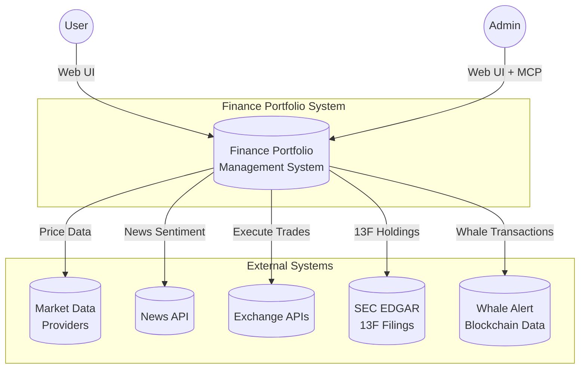
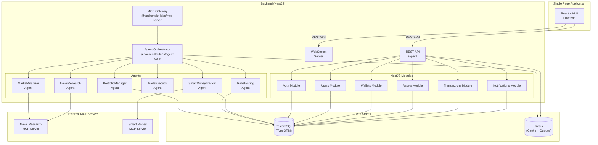
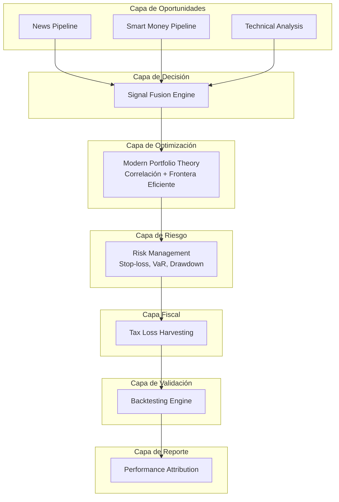
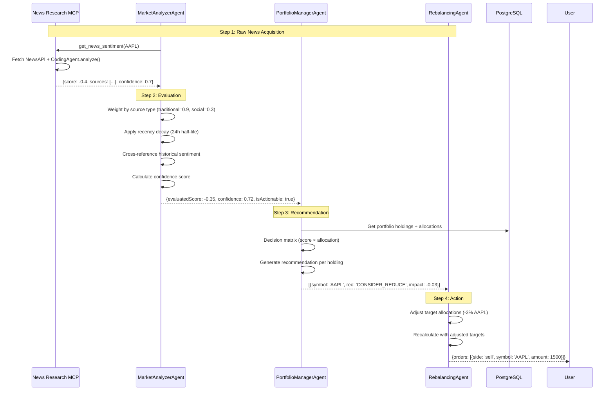
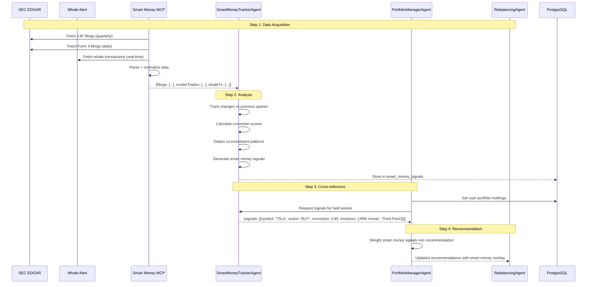
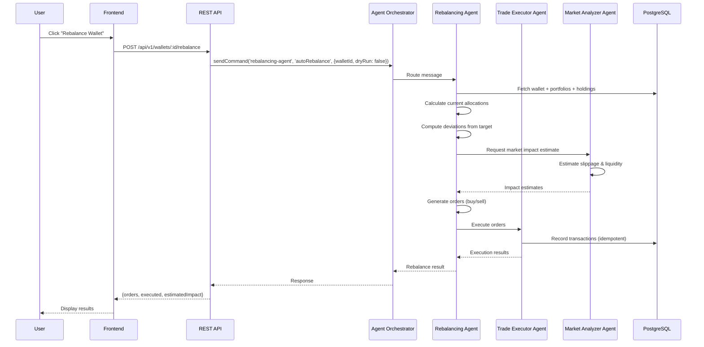
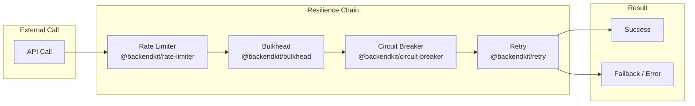
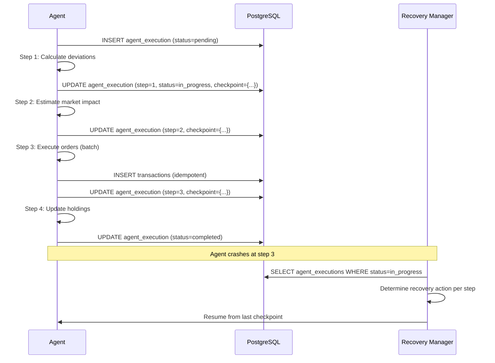

# Design Document — Finance Portfolio Management System

> **Status**: Draft  
> **Last Updated**: 2026-06-06  
> **Version**: 0.1.0

---

## 1. System Overview

A financial portfolio management application that allows users to manage multiple investment wallets, each containing multiple portfolios of stocks and cryptocurrencies. The system features autonomous agents for portfolio analysis, automatic rebalancing, market analysis, trade execution, news-based sentiment analysis, and **smart money tracking** — all orchestrated by `@backendkit-labs/agent-core`.

### 1.1 Purpose
Provide individual and professional investors with an intelligent, agent-driven platform to manage, analyze, and optimize their investment portfolios with minimal manual intervention.

### 1.2 Stakeholders
- **End Users**: Individual investors, financial advisors
- **System Administrators**: Platform operators managing users and configurations
- **External Systems**: Market data providers, news APIs, exchange APIs

---

## 2. Architecture (C4 Level 1 — System Context)



---

## 3. Container Diagram (C4 Level 2)



---

## 4. Technology Stack

| Layer | Technology | Version | Purpose |
|-------|-----------|---------|---------|
| **Runtime** | Node.js | 20+ | JavaScript runtime |
| **Language** | TypeScript | 5.x | Type safety |
| **Backend Framework** | NestJS | 10.x | Modular backend |
| **ORM** | TypeORM | 0.3.x | Database access |
| **Database** | PostgreSQL | 15+ | Primary data store |
| **Cache** | Redis | 7.x | Caching, queues, agent transport |
| **Agent Engine** | @backendkit-labs/agent-core | latest | Multi-agent orchestration |
| **Agent Coding** | @backendkit-labs/agent-coding | latest | Code generation agents |
| **MCP Server** | @backendkit-labs/mcp-server | latest | Expose agents as MCP tools |
| **MCP Client SDK** | @modelcontextprotocol/sdk | latest | External MCP connections |
| **Resilience** | @backendkit-labs/circuit-breaker | latest | Fault tolerance |
| **Resilience** | @backendkit-labs/retry | latest | Retry with backoff |
| **Resilience** | @backendkit-labs/bulkhead | latest | Concurrency limiting |
| **Resilience** | @backendkit-labs/rate-limiter | latest | Rate limiting |
| **Idempotency** | @backendkit-labs/idempotency | latest | Duplicate prevention |
| **Logging** | @backendkit-labs/observability | latest | Structured logging |
| **Frontend Framework** | React | 18.x | UI framework |
| **Build Tool** | Vite | 5.x | Fast dev server + bundler (ESM nativo) |
| **Routing** | React Router DOM | 6.x | Client-side routing |
| **UI Library** | MUI | 5.x | Component library |
| **Charts** | Recharts | latest | Data visualization (charts financieros) |
| **Server State** | TanStack React Query | 5.x | Caching, fetching, mutations |
| **HTTP Client** | Axios | 1.x | API calls con interceptors JWT |
| **WebSocket** | Native WebSocket + React Query | - | Tiempo real (precios, notificaciones) |
| **Containerization** | Docker Compose | latest | Local development |
| **Monorepo** | npm workspaces | - | Package management |

---

## 5. Componentes Complementarios

El diseño actual cubre **detección de oportunidades** (news, smart money, técnico) y **ejecución** (rebalanceo, trades). Sin embargo, un sistema completo de gestión de portafolios requiere **5 componentes adicionales** que operan en capas distintas:



### 5.1 Tax Loss Harvesting (Cosecha de Pérdidas Fiscales)

**Problema**: El sistema recomienda vender activos basado en señales de mercado, pero no considera si esa venta genera una ganancia de capital imponible o si se puede compensar con pérdidas de otros activos.

**Solución**: Un `TaxLossHarvestingService` que:
1. Mantiene un registro de todas las transacciones con su base impositiva (cost basis)
2. Calcula ganancias/pérdidas realizadas y no realizadas por activo
3. Identifica oportunidades de harvest: vender activos con pérdida no realizada para compensar ganancias
4. Respeta la regla **wash-sale** (no recomprar el mismo activo en 30 días)
5. Prioriza ventas con mayor beneficio fiscal sobre señales de mercado neutrales

```typescript
interface TaxHarvestOpportunity {
  symbol: string;
  unrealizedLoss: number;       // Pérdida no realizada en $
  holdingPeriod: number;        // Días desde la compra
  washSaleRisk: boolean;        // Si se recompró en últimos 30 días
  taxBenefit: number;           // Beneficio fiscal estimado
  priority: 'HIGH' | 'MEDIUM' | 'LOW';
  
  // Si hay ganancias realizadas que compensar
  offsetGains: Array<{
    symbol: string;
    realizedGain: number;
    taxRate: number;
  }>;
}
```

**Integración con Signal Fusion Engine**: Cuando dos activos tienen señales similares (ambos HOLD), el que tenga oportunidad de tax loss harvesting se prioriza para venta.

### 5.2 Backtesting de Estrategias

**Problema**: Las señales de los agentes (news, smart money, técnico) no se pueden validar históricamente. El usuario no sabe si seguir a Cathie Wood habría sido rentable en el pasado.

**Solución**: Un `BacktestingEngine` que:
1. Almacena señales históricas generadas por los agentes (ya se persisten en `news_evaluations`, `smart_money_signals`, `fused_signals`)
2. Permite al usuario seleccionar un período y una estrategia (ej: "seguir señales de ARK Invest en 2024")
3. Simula las operaciones que se habrían ejecutado
4. Compara el rendimiento contra un benchmark (S&P 500, BTC, etc.)
5. Genera métricas: Sharpe ratio, drawdown máximo, win rate, alpha, beta

```typescript
interface BacktestResult {
  strategy: string;              // 'follow-ark-2024', 'signal-fusion-default'
  period: { from: string; to: string };
  benchmark: string;             // 'SPY', 'BTC'
  
  initialCapital: number;
  finalCapital: number;
  totalReturn: number;           // %
  benchmarkReturn: number;       // %
  alpha: number;                 // Exceso de retorno vs benchmark
  
  metrics: {
    sharpeRatio: number;
    maxDrawdown: number;         // %
    winRate: number;             // % de trades ganadores
    totalTrades: number;
    averageHoldingPeriod: number; // Días
  };
  
  trades: Array<{
    date: string;
    symbol: string;
    side: 'buy' | 'sell';
    price: number;
    return: number;              // % de retorno del trade
    signalSource: string;        // Qué agente generó la señal
  }>;
}
```

**Valor para el usuario**: Poder responder "¿qué tan buenas son las señales de este agente?" antes de seguirlas.

### 5.3 Risk Management Layer

**Problema**: El sistema no tiene reglas de riesgo a nivel de portafolio. Un usuario podría tener 80% en un solo activo si las señales son muy positivas.

**Solución**: Un `RiskManager` que impone reglas configurables:

```typescript
interface RiskRules {
  // Límites por activo
  maxSingleAssetAllocation: number;     // 20% por defecto
  maxSectorAllocation: number;          // 40% por sector
  
  // Stop-loss y take-profit
  defaultStopLoss: number;              // -15% por defecto
  defaultTakeProfit: number;            // +30% por defecto
  trailingStop: number;                 // 10% trailing
  
  // Riesgo de portafolio
  maxDrawdown: number;                  // -25% máximo antes de forzar cash
  maxVar95: number;                     // 5% VaR máximo
  minCashReserve: number;               // 5% siempre en efectivo
  
  // Concentración
  maxCorrelationExposure: number;       // 50% en activos correlacionados >0.7
}
```

**Integración**: El `RebalancingAgent` NO puede ejecutar una orden que viole las reglas de riesgo. Si la fusión de señales recomienda STRONG_BUY para AAPL pero ya está al 20%, la orden se rechaza.

### 5.4 Performance Attribution

**Problema**: El usuario ve que su portafolio subió 5% en el mes, pero no sabe **por qué**. ¿Fue por sus decisiones? ¿Por las señales de los agentes? ¿O simplemente porque el mercado subió?

**Solución**: Un `PerformanceAttributionService` que descompone el retorno:

```typescript
interface AttributionReport {
  period: { from: string; to: string };
  totalReturn: number;
  
  // Atribución por decisión
  attribution: {
    marketMovement: number;      // % explicado por el mercado general
    assetAllocation: number;     // % por decisión de asignación
    securitySelection: number;   // % por selección de activos individuales
    tradingActivity: number;     // % por actividad de trading (comisiones, timing)
    taxImpact: number;           // % por impacto fiscal
  };
  
  // Atribución por agente
  agentPerformance: Array<{
    agentName: string;
    tradesFollowed: number;
    tradesAgainst: number;
    returnWhenFollowed: number;  // Retorno cuando se siguió al agente
    returnWhenIgnored: number;   // Retorno cuando se ignoró
    accuracy: number;            // % de veces que acertó
  }>;
  
  // Breakdown por activo
  assetBreakdown: Array<{
    symbol: string;
    allocation: number;
    return: number;
    contribution: number;        // Contribución al retorno total
  }>;
}
```

**Valor**: El usuario puede ver qué agente está generando más valor y ajustar los pesos del Signal Fusion Engine en consecuencia.

### 5.5 Modern Portfolio Theory (Optimización de Portafolio)

**Problema**: Las asignaciones objetivo son manuales. El usuario dice "quiero 30% AAPL, 20% BTC" sin considerar cómo se correlacionan entre sí.

**Solución**: Un `PortfolioOptimizer` que calcula la **frontera eficiente de Markowitz**:

```typescript
interface EfficientFrontier {
  portfolios: Array<{
    expectedReturn: number;
    volatility: number;          // Desviación estándar
    sharpeRatio: number;
    allocations: Record<string, number>;
  }>;
  
  // Puntos clave
  maxSharpePortfolio: { expectedReturn: number; volatility: number; allocations: Record<string, number> };
  minVolatilityPortfolio: { expectedReturn: number; volatility: number; allocations: Record<string, number> };
  
  // Matriz de correlación entre activos
  correlationMatrix: Record<string, Record<string, number>>;
}
```

**Integración**: El `PortfolioManagerAgent` puede sugerir ajustes a las `targetAllocations` basado en la optimización de Markowitz, no solo en señales direccionales.

## 6. Key Architectural Decisions

| ID | Decision | Rationale | Alternatives Considered |
|----|----------|-----------|------------------------|
| ADR-001 | **Agent-based architecture for business logic** | Complex financial operations (rebalancing, analysis) benefit from autonomous, composable agents that can be orchestrated, monitored, and recovered independently | Traditional service orchestration, state machines |
| ADR-002 | **@backendkit-labs/agent-core for multi-agent orchestration** | Provides built-in transport (in-memory/Redis), error recovery, message routing, and tool registration | Custom message bus, BullMQ workflows |
| ADR-003 | **MCP Gateway to expose agents externally** | Allows external tools and future frontends to interact with agents via standardized MCP protocol | Direct REST endpoints per agent |
| ADR-004 | **PostgreSQL + TypeORM for persistence** | Relational data model with complex relationships (wallets → portfolios → holdings) benefits from ACID compliance | MongoDB (document model), Prisma |
| ADR-005 | **Redis for agent transport in production** | Enables distributed agent execution across multiple backend instances | In-memory only (single instance), RabbitMQ |
| ADR-006 | **REST + WebSocket for frontend communication** | REST for CRUD operations, WebSocket for real-time price updates and agent notifications | GraphQL, gRPC |
| ADR-007 | **Separate MCP server for news research** | Isolates external API dependencies (NewsAPI) and allows independent scaling | Embedded agent within backend |
| ADR-008 | **Idempotency on trade execution** | Prevents duplicate trades from retry logic or agent re-delivery | Manual deduplication, database unique constraints |
| ADR-009 | **Circuit breaker on all external calls** | Protects system from cascading failures when market data or exchange APIs are unavailable | Timeout-only, retry-only |
| ADR-010 | **npm workspaces monorepo** | Shared TypeScript configs, unified dependency management, simplified CI/CD | Turborepo, Lerna, separate repos |
| ADR-011 | **Smart Money Tracking Agent** | Institutional investor movements (13F, Form 4, whale tx) provide high-conviction signals that complement news sentiment and technical analysis | Manual research only, third-party signal providers |
| ADR-012 | **Separate Smart Money MCP server** | SEC EDGAR parsing and blockchain data normalization are complex, rate-limited, and best isolated in a dedicated service | Embedded parsing in backend, third-party API only |
| ADR-013 | **Tax Loss Harvesting as post-fusion filter** | Fiscal optimization should not override market signals but should influence tie-breaking between similar signals | Pre-fusion weight adjustment, separate trading system |
| ADR-014 | **Backtesting engine using persisted signal history** | All agent signals are already persisted (news_evaluations, smart_money_signals, fused_signals) — backtesting is a read-only analysis over historical data | Real paper trading, third-party backtesting tools |
| ADR-015 | **Risk management as hard constraints on RebalancingAgent** | Risk rules must be enforced at execution time, not just advisory — prevents catastrophic losses from aggregated signal errors | Soft warnings only, post-trade risk checks |
| ADR-016 | **Performance attribution as a reporting layer** | Attribution is analytical, not operational — runs on demand or scheduled, does not affect trading decisions | Real-time attribution on every trade |
| ADR-017 | **Modern Portfolio Theory as optimization suggestion** | MPT provides target allocations based on correlation and volatility — complements but does not replace signal-based rebalancing | Full automated MPT rebalancing, manual allocation only |

---

## 6. Data Flow — News → Evaluation → Recommendation Pipeline



### Decision Matrix for Recommendations

| Sentiment Score | Allocation | Recommendation |
|----------------|------------|---------------|
| > 0.5 | < 5% | CONSIDER_INCREASE |
| < -0.5 | > 10% | CONSIDER_REDUCE |
| < -0.7 | Any | CONSIDER_EXIT |
| Improving + > 0.3 | Any | HOLD_POSITIVE |
| Declining + < -0.3 | Any | MONITOR_CLOSELY |
| Otherwise | Any | HOLD |

### Source Reliability Weights

| Source Type | Weight | Examples |
|-------------|--------|---------|
| traditional | 0.9 | Reuters, Bloomberg, Financial Times |
| official | 0.85 | SEC filings, company press releases |
| blog | 0.5 | Analyst blogs, Seeking Alpha |
| social | 0.3 | Twitter, Reddit, StockTwits |

## 7. Data Flow — Smart Money Tracking Pipeline

### 7.1 Concept

El **SmartMoneyTrackerAgent** monitorea los movimientos de inversores institucionales y grandes tenedores ("ballenas") cuyas posiciones son de conocimiento público, para generar señales de inversión que el usuario puede incorporar en sus decisiones.

### 7.2 Fuentes de Datos

| Fuente | Tipo | Datos Obtenidos | Frecuencia |
|--------|------|-----------------|------------|
| **SEC EDGAR (13F)** | Filing regulatorio | Holdings trimestrales de fondos >$100M | Trimestral (45 días después del cierre) |
| **SEC Form 4** | Filing regulatorio | Compras/ventas de insider traders | Diaria |
| **Whale Alert** | Blockchain | Transacciones >$100K en crypto | Tiempo real |
| **Bloomberg Terminal API** | Datos institucionales | Flujos de fondos institucionales | Diaria |
| **ETF Flow Data** | Datos de mercado | Flujos de entrada/salida por ETF | Diaria |

### 7.3 Pipeline Completo



### 7.4 Smart Money Signal Generation

```typescript
interface SmartMoneySignal {
  symbol: string;
  signalType: 'BULLISH' | 'BEARISH' | 'NEUTRAL';
  conviction: number;           // 0-1, confidence in the signal
  source: '13F' | 'FORM_4' | 'WHALE' | 'ETF_FLOW';
  
  // Institutional investors backing this signal
  backingInvestors: Array<{
    name: string;               // 'ARK Invest', 'Berkshire Hathaway'
    fundType: 'hedge_fund' | 'mutual_fund' | 'family_office' | 'pension_fund';
    positionChange: number;     // % change in position
    currentValue: number;       // $ value of position
    conviction: number;         // 0-1 based on fund's historical accuracy
  }>;
  
  // Aggregated metrics
  totalInstitutionalInflow: number;   // Net $ inflow from tracked investors
  totalInstitutionalOutflow: number;  // Net $ outflow
  netFlow: number;                    // inflow - outflow
  investorCount: number;              // Number of tracked investors moving this asset
  
  // Metadata
  detectedAt: string;
  filingPeriod: string;         // '2026-Q1'
  expiresAt: string;            // Signals decay over time (90 days for 13F)
}
```

### 7.5 Conviction Scoring Algorithm

```
conviction = baseScore × recencyWeight × consistencyWeight × sourceWeight

Donde:
- baseScore: 0.3 (FORM_4) | 0.5 (WHALE) | 0.7 (13F) | 0.8 (multiple sources)
- recencyWeight: 1.0 (≤30d) → 0.5 (60d) → 0.2 (90d) → 0.0 (>90d)
- consistencyWeight: 1.0 (1 quarter) | 1.2 (2 consecutive) | 1.5 (3+ consecutive)
- sourceWeight: 1.0 (1 source) | 1.3 (2 sources) | 1.5 (3+ sources)
```

### 7.6 Co-Investment Detection

Detecta cuando múltiples inversores institucionales están moviéndose en la misma dirección:

```typescript
interface CoInvestmentCluster {
  symbol: string;
  direction: 'accumulating' | 'distributing';
  investorCount: number;
  totalCapital: number;           // Combined $ value
  topInvestors: string[];         // Names of participating funds
  averageConviction: number;
  signalStrength: 'WEAK' | 'MODERATE' | 'STRONG' | 'VERY_STRONG';
  
  // Thresholds:
  // WEAK: 2-3 investors, <$50M combined
  // MODERATE: 4-7 investors, $50M-$500M
  // STRONG: 8-15 investors, $500M-$5B
  // VERY_STRONG: 15+ investors, >$5B
}
```

### 7.7 Integration with PortfolioManagerAgent

El `PortfolioManagerAgent` incorpora las señales de smart money en su matriz de recomendación:

| Smart Money Signal | News Sentiment | Recomendación Combinada |
|-------------------|----------------|------------------------|
| BULLISH (conv > 0.7) | Positivo | STRONG_BUY |
| BULLISH (conv > 0.7) | Neutro | CAUTIOUS_BUY |
| BULLISH (conv > 0.7) | Negativo | HOLD (conflicto) |
| BEARISH (conv > 0.7) | Negativo | STRONG_SELL |
| BEARISH (conv > 0.7) | Positivo | MONITOR (conflicto) |
| NEUTRAL | Cualquiera | Usar solo news |

### 7.8 Inversores Trackeados por Defecto

| Inversor | Tipo | Fuente Principal | Estrategia Conocida |
|----------|------|------------------|---------------------|
| **ARK Invest (Cathie Wood)** | Hedge fund | 13F | Innovación disruptiva, high-growth |
| **Berkshire Hathaway** | Holding | 13F | Value investing, long-term |
| **Bridgewater Associates** | Hedge fund | 13F | Macro global, risk parity |
| **Renaissance Technologies** | Hedge fund | 13F | Quant, high-frequency |
| **BlackRock** | Asset manager | 13F + ETF flows | Index, passive management |
| **Vanguard** | Asset manager | 13F + ETF flows | Index, low-cost |
| **Third Point (Dan Loeb)** | Hedge fund | 13F | Activist investing |
| **Pershing Square (Bill Ackman)** | Hedge fund | 13F | Concentrated, activist |
| **Scion Asset Management (Michael Burry)** | Hedge fund | 13F | Value, contrarian |
| **Tiger Global** | Hedge fund | 13F | Growth, tech-focused |

### 7.9 Smart Money MCP Server (Externo)

Servidor MCP separado que normaliza datos de múltiples fuentes:

```typescript
// mcp-servers/smart-money-mcp/src/index.ts
import { McpServer } from '@backendkit-labs/mcp-server';

const server = new McpServer({ name: 'smart-money', version: '1.0.0' });

server.tool('get_13f_filings', 'Obtiene holdings 13F de un inversor institucional', async ({ cik, quarter, year }) => {
  // Fetch from SEC EDGAR: https://www.sec.gov/cgi-bin/browse-edgar?action=getcompany&CIK={cik}
  // Parse XML/JSON filing
  // Return normalized holdings
});

server.tool('get_form4_filings', 'Obtiene transacciones insider recientes', async ({ ticker, daysBack = 30 }) => {
  // Fetch from SEC EDGAR Form 4 filings
});

server.tool('get_whale_transactions', 'Obtiene transacciones grandes en blockchain', async ({ blockchain = 'all', minUsd = 100000 }) => {
  // Fetch from Whale Alert API or similar
});

server.tool('get_investor_profile', 'Obtiene perfil completo de un inversor', async ({ investorName }) => {
  // Returns: strategy, top holdings, historical performance, recent moves
});

server.start({ transport: 'stdio' });
```

## 8. Data Flow — Rebalance Operation



---

## 8. Signal Fusion Engine

### 8.1 Concepto

El `SignalFusionEngine` es el componente central que **fusiona las señales de todos los pipelines** (news, smart money, técnico) en una recomendación única por activo. Reside dentro del `PortfolioManagerAgent` y sigue este proceso:

```
News Signal ─┐
Smart Money  ─┼──→ Normalize → Weight → Fuse → FusedSignal
Technical    ─┘
```

### 8.2 Flujo de Fusión

```mermaid
graph TB
    subgraph "Input Signals"
        N[News Signal\n-1 to +1]
        SM[Smart Money\nBULLISH/BEARISH]
        T[Technical\nRSI, MACD]
    end
    
    subgraph "Signal Fusion Engine"
        NORM[1. Normalize\nCommon format]
        WEIGHT[2. Apply Weights\nConfigurable per user]
        CONFLICT[3. Detect Conflict\nBullish vs Bearish]
        FUSE[4. Calculate\nWeighted Score]
        ACTION[5. Map to Action\nSTRONG_BUY to STRONG_SELL]
    end
    
    subgraph "Output"
        FS[FusedSignal\n{action, score, confidence, rationale}]
    end
    
    N --> NORM
    SM --> NORM
    T --> NORM
    NORM --> WEIGHT
    WEIGHT --> CONFLICT
    CONFLICT --> FUSE
    FUSE --> ACTION
    ACTION --> FS
```

### 8.3 Pesos por Defecto

| Fuente | Peso | Justificación |
|--------|------|---------------|
| Smart Money 13F | 35% | Datos institucionales, alta confianza |
| News | 30% | Actualidad, pero requiere validación |
| Smart Money Form 4 | 15% | Insider trading, señal temprana |
| Smart Money Whale | 10% | Relevante para crypto |
| Technical | 10% | Complementario, menor peso |

### 8.4 Perfiles de Inversión

| Perfil | News | 13F | Form4 | Whale | Technical |
|--------|------|-----|-------|-------|-----------|
| Value Investor | 20% | 50% | 15% | 5% | 10% |
| Growth Investor | 35% | 30% | 10% | 5% | 20% |
| Crypto Trader | 20% | 5% | 5% | 50% | 20% |
| Conservative | 25% | 45% | 15% | 5% | 10% |

### 8.5 Resolución de Conflictos

Cuando las fuentes se contradicen (news bearish, smart money bullish):

1. **Calcular peso ponderado** de cada lado
2. Si un lado tiene >1.5× el peso del otro → inclinarse hacia ese lado
3. Si hay co-investment cluster STRONG/VERY_STRONG → priorizar smart money
4. Si los pesos son similares y hay conflicto HIGH → forzar CONFLICT_HOLD

## 9. Frontend Architecture — Feature-Sliced Design (FSD)

### 9.1 Principio de Organización

El frontend se organiza con **Feature-Sliced Design (FSD)**, una arquitectura que agrupa el código por **dominios de negocio** (features) en lugar de por tipo técnico. Cada feature es autocontenida: tiene su propia API, hooks, componentes y tipos.

```
pages/         → Composición de features (1 página = 1 ruta)
features/      → Módulos de negocio autocontenidos
shared/        → Código compartido (API client, tipos, UI kit)
```

### 9.2 ¿Por qué FSD y no otras alternativas?

| Criterio | Feature-Sliced ✅ | Pages/Components (típico) | Atomic Design |
|----------|-------------------|--------------------------|---------------|
| **Escalabilidad con 12+ features** | ✅ Excelente — cada feature es autocontenida | ❌ pages/ se vuelve inmanejable | ⚠️ Regular — átomos no reflejan dominio |
| **Separación por dominio** | ✅ wallets/, fusion/, backtesting/ | ❌ Todo mezclado en components/ | ❌ Solo UI, no dominio |
| **Tipos compartidos con backend** | ✅ shared/api/types/ con contrato | ❌ Tipos duplicados en cada página | ❌ No aplica |
| **WebSocket + estado real-time** | ✅ shared/hooks/useWebSocket.ts | ⚠️ Hook global único | ❌ No considera |
| **Aislamiento de features** | ✅ Cambiar backtesting no afecta wallets | ❌ Un componente roto afecta múltiples páginas | ⚠️ Dependencia entre átomos/moléculas |

### 9.3 Estructura Completa del Frontend

```
frontend-admin/
├── src/
│   ├── app/                          ← Configuración de la aplicación
│   │   ├── App.tsx                   ← Router principal
│   │   ├── providers.tsx             ← Providers (QueryClient, MUI theme, WebSocket)
│   │   └── routes.tsx                ← Definición de rutas
│   │
│   ├── pages/                        ← Páginas (composición de features)
│   │   ├── login/
│   │   ├── dashboard/
│   │   ├── wallets/
│   │   │   ├── [id]/
│   │   │   │   ├── portfolios/
│   │   │   │   └── rebalance/
│   │   ├── fusion/
│   │   ├── smart-money/
│   │   ├── backtesting/
│   │   ├── risk/
│   │   ├── tax-harvest/
│   │   ├── performance/
│   │   ├── alerts/
│   │   └── settings/
│   │
│   ├── features/                     ← Módulos de negocio autocontenidos
│   │   ├── auth/
│   │   │   ├── api/auth.api.ts
│   │   │   ├── hooks/useLogin.ts
│   │   │   ├── components/LoginForm.tsx
│   │   │   └── types.ts
│   │   ├── wallets/
│   │   │   ├── api/wallet.api.ts
│   │   │   ├── hooks/useWallets.ts
│   │   │   ├── components/WalletCard.tsx
│   │   │   └── types.ts
│   │   ├── fusion/                   ← Feature más compleja
│   │   │   ├── api/fusion.api.ts
│   │   │   ├── hooks/useFusionSignal.ts
│   │   │   ├── components/FusionCard.tsx
│   │   │   ├── components/FusionBreakdown.tsx
│   │   │   ├── components/ConflictBadge.tsx
│   │   │   ├── components/WeightSlider.tsx
│   │   │   └── types.ts
│   │   ├── smart-money/
│   │   ├── backtesting/
│   │   ├── risk/
│   │   ├── tax-harvest/
│   │   ├── performance/
│   │   ├── assets/
│   │   ├── transactions/
│   │   ├── alerts/
│   │   └── mcp-servers/
│   │
│   ├── shared/                        ← Código compartido entre features
│   │   ├── api/
│   │   │   ├── client.ts              ← Axios instance con interceptors JWT
│   │   │   ├── ws-client.ts           ← WebSocket client
│   │   │   └── types/                 ← Tipos del backend (contrato)
│   │   │       ├── wallet.types.ts
│   │   │       ├── fusion.types.ts
│   │   │       ├── smart-money.types.ts
│   │   │       └── index.ts
│   │   ├── hooks/
│   │   │   ├── useWebSocket.ts
│   │   │   ├── usePagination.ts
│   │   │   └── useDebounce.ts
│   │   ├── components/                ← UI Kit genérico
│   │   │   ├── Layout.tsx
│   │   │   ├── Sidebar.tsx
│   │   │   ├── DataTable.tsx
│   │   │   ├── Chart.tsx              ← Wrapper sobre Recharts
│   │   │   ├── MetricCard.tsx
│   │   │   ├── LoadingState.tsx
│   │   │   ├── ErrorState.tsx
│   │   │   └── EmptyState.tsx
│   │   └── utils/
│   │       ├── format-currency.ts
│   │       ├── format-percentage.ts
│   │       └── format-date.ts
│   │
│   ├── styles/
│   │   ├── theme.ts                   ← Tema MUI personalizado
│   │   └── global.css
│   │
│   └── main.tsx                       ← Entry point
│
├── public/
│   └── index.html
│
├── package.json
├── tsconfig.json
├── vite.config.ts
└── Dockerfile
```

### 9.4 Reglas de Dependencia

```
pages/ → features/ (composición de features en una página)
features/ → shared/ (api, hooks, componentes, tipos)
shared/ → (nada — es la capa base)
```

**Prohibido**:
- ❌ `features/ → pages/` (un feature no conoce las páginas)
- ❌ `features/ → other-features/` (un feature no importa de otro feature)
- ❌ `shared/ → features/` (shared no conoce los features)

### 9.5 Patrón por Feature

Cada feature sigue una estructura consistente:

```
fusion/
├── api/fusion.api.ts          ← Llamadas HTTP (axios)
├── hooks/useFusionSignal.ts   ← Hooks con React Query (useQuery, useMutation)
├── components/FusionCard.tsx  ← Componentes UI específicos del feature
└── types.ts                   ← Tipos específicos (interfaces, enums)
```

### 9.6 Ejemplo: Página de Fusion

```tsx
// pages/fusion/[portfolioId].tsx
import { FusionPortfolioTable } from '@/features/fusion/components/FusionPortfolioTable';
import { FusionBreakdown } from '@/features/fusion/components/FusionBreakdown';
import { WeightSlider } from '@/features/fusion/components/WeightSlider';
import { usePortfolioFusion } from '@/features/fusion/hooks/usePortfolioFusion';
import { Layout } from '@/shared/components/Layout';
import { LoadingState } from '@/shared/components/LoadingState';
import { ErrorState } from '@/shared/components/ErrorState';

export default function FusionPage({ portfolioId }: { portfolioId: string }) {
  const { data, isLoading, error } = usePortfolioFusion(portfolioId);
  
  if (isLoading) return <LoadingState />;
  if (error) return <ErrorState error={error} />;
  
  return (
    <Layout title="Signal Fusion">
      <FusionPortfolioTable signals={data.signals} />
      <FusionBreakdown contributions={data.contributions} />
      <WeightSlider />
    </Layout>
  );
}
```

### 9.7 ¿Por qué Vite y no CRA o Next.js?

| Criterio | Vite ✅ | Create React App | Next.js |
|----------|---------|------------------|---------|
| **Velocidad de desarrollo** | Instantáneo (ESM nativo) | Lento (Webpack) | Rápido |
| **Bundle size** | Pequeño | Grande | Medio |
| **SPA puro** | ✅ Excelente | ✅ Bueno | ❌ SSR (innecesario aquí) |
| **WebSocket** | ✅ Fácil | ✅ Fácil | ⚠️ Requiere configuración extra |
| **API routes** | ❌ No necesita | ❌ No necesita | ✅ Tiene, pero no las usamos |

**Conclusión**: Vite + React Router DOM. El backend ya expone su propia API REST. No necesitamos SSR ni API routes de Next.js.

### 9.8 Manejo de Estado

| Tipo de Estado | Herramienta | ¿Qué contiene? |
|----------------|-------------|----------------|
| **Server state** (API) | TanStack React Query | Wallets, portfolios, signals, backtest results |
| **Real-time** (WebSocket) | Custom hook `useWebSocket` | Precios en vivo, notificaciones de agentes |
| **UI state** (local) | React useState/useReducer | Formularios, modales, paneles expandidos |
| **Auth state** | React Context + React Query | Token JWT, usuario actual, rol |

No se necesita Redux ni Zustand — React Query + Context cubre todo.

## 10. Project Structure — Modular Monolith con 3 Zonas

### 9.1 Principio de Organización

El proyecto se organiza en **3 zonas** dentro del backend, cada una con un propósito, ciclo de vida y reglas de dependencia distintos:

| Zona | Propósito | Ciclo de Vida | Depende de |
|------|-----------|---------------|------------|
| **agents/** | Lógica de negocio, orquestación, herramientas @Tool | Largo, stateful (checkpointing) | modules, services |
| **modules/** | CRUD, entidades TypeORM, repositorios, DTOs, controladores REST | Largo, stateful (DB) | shared |
| **services/** | Cálculos puros, análisis, sin estado, sin IO directa | Corto, stateless | shared (tipos) |

**Reglas de dependencia estrictas**:
- `agents/ → modules/` (inyecta repositorios)
- `agents/ → services/` (consulta análisis)
- `modules/ → shared/`
- `services/ → shared/`
- ❌ `modules/ → agents/` (prohibido)
- ❌ `services/ → modules/` (prohibido)

### 9.2 Estructura Completa

```
finance-portfolio-system/
├── backend/
│   ├── src/
│   │   ├── agents/                          ← ZONA 1: Agentes autónomos
│   │   │   ├── core/
│   │   │   │   ├── agent-orchestrator.service.ts
│   │   │   │   ├── agent-orchestrator.module.ts
│   │   │   │   └── types.ts
│   │   │   ├── portfolio-manager/
│   │   │   │   ├── portfolio-manager.agent.ts
│   │   │   │   └── portfolio-manager.module.ts
│   │   │   ├── rebalancing/
│   │   │   │   ├── rebalancing.agent.ts
│   │   │   │   └── rebalancing.module.ts
│   │   │   ├── market-analyzer/
│   │   │   │   ├── market-analyzer.agent.ts
│   │   │   │   └── market-analyzer.module.ts
│   │   │   ├── trade-executor/
│   │   │   │   ├── trade-executor.agent.ts
│   │   │   │   └── trade-executor.module.ts
│   │   │   ├── news-research/
│   │   │   │   ├── news-research.agent.ts
│   │   │   │   └── news-research.module.ts
│   │   │   └── smart-money-tracker/
│   │   │       ├── smart-money-tracker.agent.ts
│   │   │       └── smart-money-tracker.module.ts
│   │   │
│   │   ├── modules/                         ← ZONA 2: Módulos NestJS (CRUD + estado)
│   │   │   ├── auth/
│   │   │   │   ├── auth.module.ts
│   │   │   │   ├── auth.controller.ts
│   │   │   │   ├── auth.service.ts
│   │   │   │   ├── strategies/
│   │   │   │   ├── guards/
│   │   │   │   └── entities/
│   │   │   ├── users/
│   │   │   ├── wallets/
│   │   │   │   ├── wallet.module.ts
│   │   │   │   ├── wallet.controller.ts
│   │   │   │   ├── wallet.service.ts
│   │   │   │   ├── portfolio.controller.ts
│   │   │   │   ├── portfolio.service.ts
│   │   │   │   ├── entities/
│   │   │   │   │   ├── wallet.entity.ts
│   │   │   │   │   ├── portfolio.entity.ts
│   │   │   │   │   └── holding.entity.ts
│   │   │   │   └── dto/
│   │   │   ├── assets/
│   │   │   ├── transactions/
│   │   │   ├── notifications/
│   │   │   ├── smart-money/
│   │   │   │   ├── smart-money.module.ts
│   │   │   │   ├── smart-money.controller.ts
│   │   │   │   ├── smart-money.service.ts
│   │   │   │   └── entities/
│   │   │   │       ├── smart-money-signal.entity.ts
│   │   │   │       └── tracked-investor.entity.ts
│   │   │   └── alerts/
│   │   │
│   │   ├── services/                        ← ZONA 3: Servicios analíticos (stateless)
│   │   │   ├── signal-fusion/
│   │   │   │   ├── signal-fusion.module.ts
│   │   │   │   ├── signal-fusion.engine.ts
│   │   │   │   ├── signal-normalizer.ts
│   │   │   │   └── types.ts
│   │   │   ├── risk-manager/
│   │   │   │   ├── risk-manager.module.ts
│   │   │   │   ├── risk-manager.service.ts
│   │   │   │   ├── risk-rules.validator.ts
│   │   │   │   └── types.ts
│   │   │   ├── tax-harvest/
│   │   │   │   ├── tax-harvest.module.ts
│   │   │   │   ├── tax-harvest.service.ts
│   │   │   │   ├── cost-basis.tracker.ts
│   │   │   │   └── types.ts
│   │   │   ├── backtesting/
│   │   │   │   ├── backtesting.module.ts
│   │   │   │   ├── backtesting.engine.ts
│   │   │   │   ├── strategy.simulator.ts
│   │   │   │   └── types.ts
│   │   │   ├── performance/
│   │   │   │   ├── performance.module.ts
│   │   │   │   ├── performance.attribution.ts
│   │   │   │   ├── agent-performance.tracker.ts
│   │   │   │   └── types.ts
│   │   │   └── portfolio-optimizer/
│   │   │       ├── portfolio-optimizer.module.ts
│   │   │       ├── efficient-frontier.ts
│   │   │       ├── correlation-matrix.ts
│   │   │       └── types.ts
│   │   │
│   │   ├── mcp-gateway/
│   │   │   ├── mcp-gateway.module.ts
│   │   │   └── mcp-server.gateway.ts
│   │   │
│   │   ├── shared/
│   │   │   ├── decorators/
│   │   │   ├── filters/
│   │   │   ├── guards/
│   │   │   ├── interceptors/
│   │   │   ├── pipes/
│   │   │   └── config/
│   │   │
│   │   ├── app.module.ts
│   │   └── main.ts
│   │
│   ├── test/
│   │   ├── unit/
│   │   │   ├── agents/
│   │   │   ├── modules/
│   │   │   └── services/
│   │   ├── integration/
│   │   └── factories/
│   │
│   ├── Dockerfile
│   ├── tsconfig.json
│   └── package.json
│
├── mcp-servers/
│   ├── news-research-mcp/
│   │   ├── src/index.ts
│   │   ├── package.json
│   │   └── Dockerfile
│   └── smart-money-mcp/
│       ├── src/index.ts
│       ├── package.json
│       └── Dockerfile
│
├── frontend-admin/
│   ├── src/
│   │   ├── pages/
│   │   ├── components/
│   │   ├── hooks/
│   │   ├── services/
│   │   └── types/
│   ├── package.json
│   └── Dockerfile
│
├── docker-compose.yml
├── package.json              ← Root workspace (npm workspaces)
├── tsconfig.base.json
├── .eslintrc.js
├── .prettierrc
└── README.md
```

### 9.3 Patrón por Tipo de Componente

#### Módulos NestJS (modules/)
Cada módulo sigue el patrón estándar de NestJS con controlador, servicio, entidades y DTOs:

```
smart-money/
├── smart-money.module.ts      ← @Module({ controllers, providers, imports: [TypeOrmFeature] })
├── smart-money.controller.ts  ← @Controller('/api/v1/smart-money')
├── smart-money.service.ts     ← Lógica CRUD + consultas
├── entities/
│   ├── smart-money-signal.entity.ts
│   └── tracked-investor.entity.ts
└── dto/
    ├── create-signal.dto.ts
    └── query-signals.dto.ts
```

#### Agentes (agents/)
Cada agente es un `@Injectable()` que extiende `Agent` de `@backendkit-labs/agent-core`:

```
rebalancing/
├── rebalancing.module.ts      ← @Module({ imports: [TypeOrmFeature], providers: [RebalancingAgent] })
├── rebalancing.agent.ts       ← @Injectable() extends Agent { @Tool() ... }
```

#### Servicios Analíticos (services/)
Son **stateless**, no tienen entidades TypeORM propias (leen de los módulos a través de los agentes):

```
signal-fusion/
├── signal-fusion.module.ts    ← @Global() @Module({ providers: [SignalFusionEngine], exports: [...] })
├── signal-fusion.engine.ts    ← Lógica de fusión pura
├── signal-normalizer.ts       ← Normalización de señales
└── types.ts                   ← NormalizedSignal, FusedSignal, ConflictInfo
```

### 9.4 ¿Por qué Modular Monolith y no Microservicios?

| Criterio | Modular Monolith (elegido) | Microservicios |
|----------|---------------------------|----------------|
| **Complejidad inicial** | Baja — un solo proceso NestJS | Alta — orquestación, red, consistencia eventual |
| **Latencia entre agentes** | In-memory (agent-core transport) | Red (HTTP/mensajería) |
| **Checkpointing/Saga** | Transaccional en una DB | Saga distribuida (mucho más compleja) |
| **Signal Fusion** | Llamadas directas entre servicios | Llamadas HTTP entre servicios |
| **Equipo requerido** | 1 equipo pequeño | Múltiples equipos |
| **Escalabilidad** | Vertical + horizontal (Redis transport) | Horizontal independiente |

**Evolución futura**: Si un servicio específico (ej. backtesting) requiere escalar independientemente por uso intensivo de CPU, se extrae a microservicio **individualmente** sin reestructurar todo el proyecto.

---

## 9. Resilience Architecture



---

## 10. Deployment Architecture

```yaml
# docker-compose.yml services
services:
  postgres:
    image: postgres:15
    volumes: [pgdata:/var/lib/postgresql/data]
    
  redis:
    image: redis:7-alpine
    
  backend:
    build: ./backend
    depends_on: [postgres, redis]
    ports: ["3000:3000"]
    
  frontend:
    build: ./frontend-admin
    depends_on: [backend]
    ports: ["80:80"]
    
  news-research-mcp:
    build: ./mcp-servers/news-research-mcp
    # Communicates via stdio (no exposed port)
```

---

## 11. Performance & Scalability

- **Target**: 20 concurrent agents without degradation
- **Agent transport**: Redis pub/sub for horizontal scaling
- **Database**: Connection pooling (pg-pool), indexed queries
- **Caching**: Redis for asset prices, user sessions, agent state
- **Rate limiting**: Per-user and per-endpoint via @backendkit/rate-limiter
- **Bulkhead**: Separate thread pools for agent execution vs REST API

---

## 12. Agent State Persistence & Recovery

### 11.1 Problem Statement
Agents execute multi-step operations (e.g., rebalance → calculate deviations → estimate impact → execute orders → update holdings). If an agent crashes mid-operation, the system must recover without:
- Partial execution (some orders placed, others not)
- Duplicate trades on recovery
- Inconsistent portfolio state

### 11.2 Solution: Checkpointing + Saga Pattern



### 11.3 Agent Execution Entity

```typescript
@Entity('agent_executions')
class AgentExecution {
  @PrimaryGeneratedColumn('uuid')
  id: string;

  @Column()
  agentName: string;        // 'rebalancing-agent', 'trade-executor'

  @Column()
  operationType: string;    // 'autoRebalance', 'executeBatchOrders'

  @Column({ type: 'enum', enum: ExecutionStatus, default: 'pending' })
  status: ExecutionStatus;  // pending | in_progress | completed | failed | compensating

  @Column({ type: 'int', default: 0 })
  currentStep: number;      // Which step of the operation

  @Column({ type: 'jsonb', nullable: true })
  checkpoint: Record<string, any>;  // Serializable state snapshot

  @Column({ type: 'jsonb' })
  input: Record<string, any>;       // Original input parameters

  @Column({ type: 'jsonb', nullable: true })
  output: Record<string, any>;      // Final result (on completion)

  @Column({ type: 'jsonb', nullable: true })
  compensatingActions: Record<string, any>;  // Rollback steps for Saga

  @Column({ nullable: true })
  errorMessage: string;

  @Column({ type: 'int', default: 0 })
  retryCount: number;

  @Column({ type: 'int', default: 3 })
  maxRetries: number;

  @CreateDateColumn()
  createdAt: Date;

  @UpdateDateColumn()
  updatedAt: Date;
}

enum ExecutionStatus {
  PENDING = 'pending',
  IN_PROGRESS = 'in_progress',
  COMPLETED = 'completed',
  FAILED = 'failed',
  COMPENSATING = 'compensating',
  COMPENSATED = 'compensated',
}
```

### 11.4 Recovery Protocol

| Step | Action on Failure | Recovery Strategy |
|------|-------------------|-------------------|
| 1. Calculate deviations | Safe to retry (read-only) | Retry from step 1 |
| 2. Estimate market impact | Safe to retry (read-only) | Retry from step 2 |
| 3. Execute orders (batch) | **Idempotent** — each order has idempotencyKey | Query which orders were placed, skip duplicates |
| 4. Update holdings | **Idempotent** — computed from transactions | Recalculate from transactions table |
| Saga compensate | Reverse executed orders, mark execution as `compensated` | Execute compensating transactions |

### 11.5 Saga Pattern for Multi-Step Operations

For operations that span multiple write steps (rebalance → trade → update), implement a **compensating Saga**:

```typescript
// Saga coordinator pseudocode
async function executeRebalanceSaga(executionId: string, steps: Step[]) {
  const executedSteps: Step[] = [];
  
  try {
    for (const step of steps) {
      await step.execute();
      executedSteps.push(step);
      await saveCheckpoint(executionId, step);
    }
    await markCompleted(executionId);
  } catch (error) {
    // Execute compensating actions in reverse order
    for (const step of executedSteps.reverse()) {
      await step.compensate();
    }
    await markCompensated(executionId, error);
    throw error;
  }
}
```

### 11.6 Agent Recovery Manager

A dedicated `AgentRecoveryService` runs on startup and periodically:
1. Queries `agent_executions` where `status = 'in_progress'` and `updatedAt > 5min`
2. Determines recovery action based on `currentStep`
3. Resumes or compensates the execution
4. Logs recovery action for audit

### 11.7 Monitoring & Observability

- **Structured logging**: @backendkit/logger with correlation IDs
- **Metrics**: Prometheus endpoints for agent health, queue depth, error rates
- **Health checks**: `/health` endpoint for each service
- **Agent recovery**: Automatic restart on failure via agent-core hooks + checkpoint recovery
