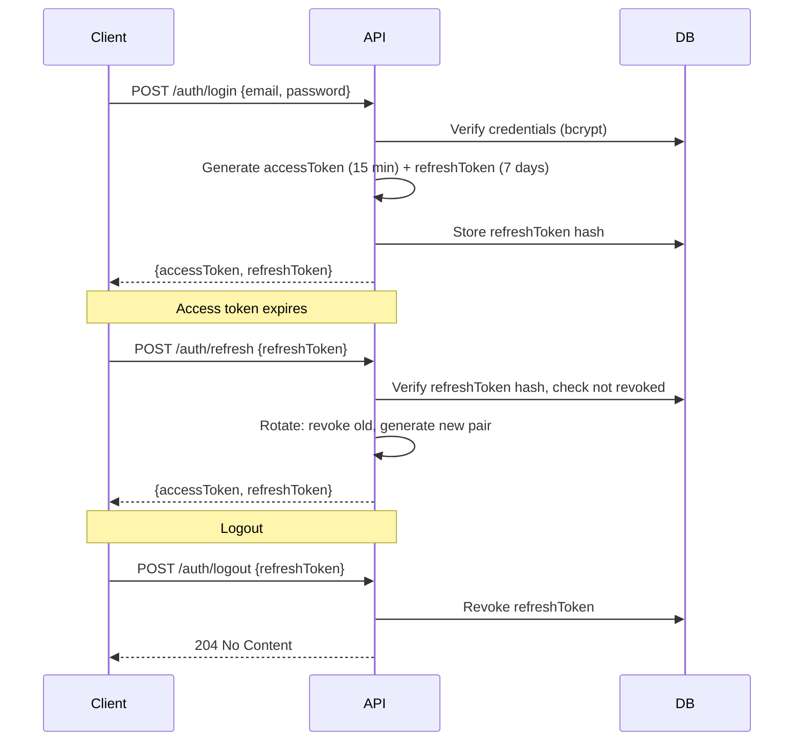

# Security Document — Finance Portfolio Management System

> **Status**: Draft  
> **Last Updated**: 2026-06-06  
> **Version**: 0.1.0

---

## 1. Threat Model

### 1.1 Assets to Protect

| Asset | Sensitivity | Impact if Compromised |
|-------|-------------|----------------------|
| User credentials (password hashes) | Critical | Account takeover |
| JWT tokens (access + refresh) | Critical | Session hijacking |
| Wallet/portfolio data | High | Financial data exposure |
| Transaction records | High | Trade history manipulation |
| API keys (market data, exchange) | Critical | Unauthorized trading, costs |
| Agent execution state | Medium | Incorrect rebalancing decisions |
| Idempotency keys | Medium | Duplicate trades |

### 1.2 Threat Actors

| Actor | Motivation | Capability |
|-------|-----------|------------|
| External attacker | Financial gain, data theft | Network-level, automated tools |
| Malicious user | Access other users' data | Valid credentials, API access |
| Insider (admin) | Data exfiltration | Database access, elevated privileges |
| Compromised MCP server | Inject malicious data | Network access to backend |

### 1.3 Threat Scenarios

| ID | Scenario | Risk | Mitigation |
|----|----------|------|------------|
| T-01 | Attacker intercepts JWT token | High | Short expiry (15 min), HTTPS only, refresh rotation |
| T-02 | Brute force login attempt | High | Rate limiting (20 req/min on auth), account lockout after 5 failures |
| T-03 | SQL injection via API params | High | TypeORM parameterized queries, input validation |
| T-04 | IDOR — access another user's wallet | High | Ownership checks on all resource endpoints |
| T-05 | Replay attack on trade execution | Medium | Idempotency keys on all transactions |
| T-06 | Malicious MCP server returns false data | Medium | Circuit breaker, data validation, audit logging |
| T-07 | Agent hallucination — incorrect rebalance | Medium | Dry-run mode, human approval for large trades, max trade limits |
| T-08 | API key leakage in logs | Medium | Secrets redaction in logger, env vars only |
| T-09 | XSS via frontend | Medium | CSP headers, input sanitization, React's built-in XSS protection |
| T-10 | CSRF on state-changing endpoints | Low | SameSite cookies, CSRF tokens for cookie-based auth |

---

## 2. Authentication Design

### 2.1 JWT Token Strategy



### 2.2 Token Specifications

| Property | Access Token | Refresh Token |
|----------|-------------|---------------|
| **Format** | JWT (signed RS256) | Opaque (random 32 bytes, hex-encoded) |
| **Expiry** | 15 minutes | 7 days |
| **Storage** | Client memory (not localStorage) | HTTP-only secure cookie + DB hash |
| **Rotation** | Not applicable | Rotated on each use (old revoked) |
| **Revocation** | Not possible (short-lived) | Immediate via DB update |
| **Claims** | sub, email, role, iat, exp | sub, jti, exp |

### 2.3 Password Policy

- Minimum 8 characters
- At least 1 uppercase letter
- At least 1 number
- Hashed with bcrypt (cost factor 12)
- No plaintext storage ever
- Rate limited: 5 attempts per email per 15 minutes

---

## 3. Authorization Model

### 3.1 Role-Based Access Control (RBAC)

| Role | Description | Permissions |
|------|-------------|-------------|
| **admin** | Full system access | All CRUD, user management, system config |
| **user** | Standard user | Own wallets, portfolios, transactions, alerts |
| **viewer** | Read-only access | View own resources, no create/update/delete |

### 3.2 Permission Matrix

| Resource | Action | admin | user | viewer |
|----------|--------|-------|------|--------|
| Users | Read | All | Self | Self |
| Users | Create | Yes | No | No |
| Users | Update | All | Self (limited) | No |
| Users | Delete | Yes | No | No |
| Wallets | Read | All | Own | Own |
| Wallets | Create | Yes | Yes | No |
| Wallets | Update | All | Own | No |
| Wallets | Delete | All | Own | No |
| Portfolios | Read | All | Own | Own |
| Portfolios | Create | Yes | Yes | No |
| Portfolios | Update | All | Own | No |
| Portfolios | Delete | All | Own | No |
| Transactions | Read | All | Own | Own |
| Transactions | Create | Yes | Yes | No |
| Assets | Read | All | All | All |
| Alerts | Read | All | Own | Own |
| Alerts | Create | Yes | Yes | No |
| Alerts | Update | All | Own | No |
| Alerts | Delete | All | Own | No |
| Rebalance | Execute | All | Own | No |
| Agent Config | Read/Write | Yes | No | No |

### 3.3 Ownership Enforcement

```typescript
// Pattern for all resource endpoints
@Get(':id')
async findOne(@Param('id') id: string, @Req() req) {
  const resource = await this.service.findOne(id);
  
  // Admin can access any resource
  if (req.user.role === 'admin') {
    return resource;
  }
  
  // User/viewer can only access own resources
  if (resource.userId !== req.user.sub) {
    throw new ForbiddenException();
  }
  
  return resource;
}
```

---

## 4. OWASP Top 10 Checklist

| # | Category | Status | Implementation |
|---|----------|--------|----------------|
| **A01** | Broken Access Control | ✅ Implemented | RBAC + ownership checks on all endpoints |
| **A02** | Cryptographic Failures | ✅ Implemented | bcrypt(12) for passwords, RS256 for JWT, HTTPS only |
| **A03** | Injection | ✅ Implemented | TypeORM parameterized queries, class-validator input validation |
| **A04** | Insecure Design | ✅ Implemented | Rate limiting, idempotency, circuit breakers |
| **A05** | Security Misconfiguration | ⚠️ Partial | Helmet middleware planned, CORS restricted to frontend origin |
| **A06** | Vulnerable Components | ⚠️ Partial | npm audit in CI, Dependabot configured |
| **A07** | Auth Failures | ✅ Implemented | JWT rotation, refresh token hashing, account lockout |
| **A08** | Data Integrity Failures | ✅ Implemented | Idempotency keys, transaction atomicity |
| **A09** | Logging & Monitoring | ⚠️ Partial | Structured logging planned, audit trail for trades |
| **A10** | SSRF | ✅ Implemented | MCP server URL whitelist, circuit breaker on external calls |

---

## 5. Security Requirements

### 5.1 Network Security

- **HTTPS only**: TLS 1.3 minimum, HSTS header
- **CORS**: Restricted to known frontend origins
- **Helmet**: Security headers (CSP, X-Frame-Options, X-Content-Type-Options)
- **Rate limiting**: 
  - General API: 100 requests/min per user
  - Auth endpoints: 20 requests/min per IP
  - Rebalance execution: 5 requests/min per wallet
  - **Agent trade execution**: 10 trades/min per wallet, 50 trades/min globally (applies to TradeExecutorAgent)
  - **Agent rebalance operations**: 2 rebalances/min per wallet (applies to RebalancingAgent)

### 5.2 API Security

- **Input validation**: class-validator DTOs on all endpoints
- **Output sanitization**: No sensitive fields in responses (password hashes, tokens)
- **Idempotency**: All trade executions require idempotency key
- **Audit logging**: All trade executions, rebalances, and admin actions logged

### 5.3 Agent Security

- **Agent isolation**: Each agent runs in its own context with limited DB access
- **MCP server validation**: External MCP responses validated before use
- **Circuit breaker**: Prevents cascading failures from compromised MCP servers
- **Agent recovery**: Automatic restart on failure, with state recovery (checkpointing + Saga pattern)
- **Agent rate limiting**: Agents have independent rate limits that cannot be bypassed via REST API:
  - TradeExecutorAgent: max 10 trades/min per wallet, 50 trades/min globally
  - RebalancingAgent: max 2 rebalance operations/min per wallet
  - MarketAnalyzerAgent: max 30 API calls/min (external MCP + technical analysis)
  - Rate limits are enforced via `@backendkit-labs/rate-limiter` with Redis backend
  - Rate limit counters are scoped by `agentName + walletId` for per-wallet limits
  - Exceeding agent rate limits queues the operation with backpressure (BullMQ) instead of dropping it

### 5.4 Data Security

- **Encryption at rest**: PostgreSQL TDE or column-level encryption for sensitive fields
- **Encryption in transit**: TLS for all network communication
- **Secrets management**: All API keys in environment variables, never in code
- **Data retention**: Transaction records retained for 7 years (regulatory), refresh tokens purged after 30 days

### 5.5 Frontend Security

- **CSP headers**: Restrict script sources, inline scripts
- **XSS prevention**: React's built-in escaping, no dangerouslySetInnerHTML
- **Token storage**: Access tokens in memory only, refresh tokens in HTTP-only cookies
- **CSRF**: SameSite=Strict cookies, CSRF tokens for state-changing requests

---

## 6. Audit Logging

```typescript
// Events to log
interface AuditEvent {
  eventType: 'trade_executed' | 'rebalance_completed' | 'user_login' | 
             'user_logout' | 'token_refresh' | 'alert_triggered' |
             'admin_action' | 'agent_error' | 'config_change';
  userId: string;
  resourceType: string;  // 'wallet', 'portfolio', 'transaction', 'alert'
  resourceId: string;
  action: string;
  details: Record<string, any>;
  ipAddress: string;
  userAgent: string;
  timestamp: string;
  correlationId: string;
}
```

---

## 7. Incident Response

| Severity | Response Time | Actions |
|----------|--------------|---------|
| **Critical** (data breach, unauthorized trades) | < 15 min | Revoke all tokens, disable trading, notify users |
| **High** (suspicious activity, rate limit bypass) | < 1 hour | Block IP, review logs, rotate API keys |
| **Medium** (failed login spike, MCP errors) | < 4 hours | Investigate, adjust rate limits, update MCP whitelist |
| **Low** (minor config issues) | < 24 hours | Fix in next deployment |

---

## 8. Security Testing

| Test Type | Frequency | Tools |
|-----------|-----------|-------|
| Dependency scanning | Every PR | npm audit, Snyk |
| SAST (Static Analysis) | Every PR | ESLint security plugin |
| DAST (Dynamic Analysis) | Weekly | OWASP ZAP |
| Penetration testing | Quarterly | External firm |
| Secret scanning | Every commit | GitLeaks / pre-commit hook |
