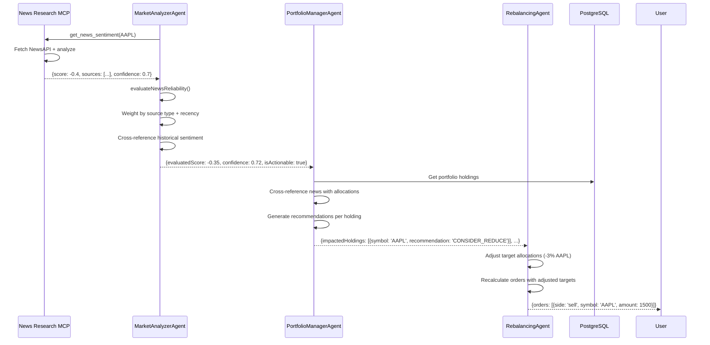
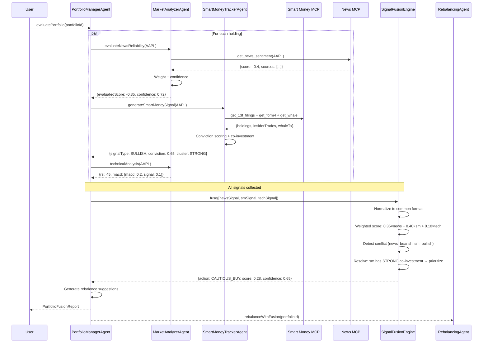

# Specification Document — Finance Portfolio Management System

> **Status**: Draft  
> **Last Updated**: 2026-06-06  
> **Version**: 0.1.0

---

## 1. Data Models

### 1.1 User

```typescript
@Entity('users')
class User {
  @PrimaryGeneratedColumn('uuid')
  id: string;

  @Column({ unique: true })
  email: string;

  @Column()
  passwordHash: string;

  @Column()
  name: string;

  @Column({ type: 'enum', enum: UserRole, default: UserRole.USER })
  role: UserRole; // admin | user | viewer

  @Column({ default: true })
  isActive: boolean;

  @CreateDateColumn()
  createdAt: Date;

  @UpdateDateColumn()
  updatedAt: Date;

  // Relations
  @OneToMany(() => Wallet, wallet => wallet.user)
  wallets: Wallet[];

  @OneToMany(() => RefreshToken, token => token.user)
  refreshTokens: RefreshToken[];
}

enum UserRole {
  ADMIN = 'admin',
  USER = 'user',
  VIEWER = 'viewer',
}
```

### 1.2 RefreshToken

```typescript
@Entity('refresh_tokens')
class RefreshToken {
  @PrimaryGeneratedColumn('uuid')
  id: string;

  @Column()
  token: string;

  @ManyToOne(() => User)
  @JoinColumn({ name: 'userId' })
  user: User;

  @Column()
  userId: string;

  @Column({ default: false })
  isRevoked: boolean;

  @Column()
  expiresAt: Date;

  @CreateDateColumn()
  createdAt: Date;
}
```

### 1.3 Wallet (Cartera)

```typescript
@Entity('wallets')
class Wallet {
  @PrimaryGeneratedColumn('uuid')
  id: string;

  @Column()
  name: string;

  @Column({ nullable: true })
  description: string;

  @Column({ type: 'decimal', precision: 18, scale: 2, default: 0 })
  totalValue: number;

  @Column({ type: 'decimal', precision: 5, scale: 2, default: 0 })
  totalReturn: number; // ROI percentage

  @ManyToOne(() => User)
  @JoinColumn({ name: 'userId' })
  user: User;

  @Column()
  userId: string;

  @CreateDateColumn()
  createdAt: Date;

  @UpdateDateColumn()
  updatedAt: Date;

  // Relations
  @OneToMany(() => Portfolio, portfolio => portfolio.wallet)
  portfolios: Portfolio[];
}
```

### 1.4 Portfolio (Portafolio)

```typescript
@Entity('portfolios')
class Portfolio {
  @PrimaryGeneratedColumn('uuid')
  id: string;

  @Column()
  name: string;

  @Column({ nullable: true })
  strategy: string; // e.g., 'growth', 'income', 'balanced'

  @Column({ type: 'decimal', precision: 18, scale: 2, default: 0 })
  totalValue: number;

  @Column({ type: 'jsonb', nullable: true })
  targetAllocations: Record<string, number>; // { "AAPL": 0.3, "BTC": 0.2, ... }

  @Column({ type: 'decimal', precision: 5, scale: 2, default: 0.05 })
  rebalanceTolerance: number; // 0.05 = 5%

  @ManyToOne(() => Wallet, wallet => wallet.portfolios)
  @JoinColumn({ name: 'walletId' })
  wallet: Wallet;

  @Column()
  walletId: string;

  @CreateDateColumn()
  createdAt: Date;

  @UpdateDateColumn()
  updatedAt: Date;

  // Relations
  @OneToMany(() => Holding, holding => holding.portfolio)
  holdings: Holding[];

  @OneToMany(() => PortfolioSnapshot, snapshot => snapshot.portfolio)
  snapshots: PortfolioSnapshot[];
}
```

### 1.5 Asset (Activo Financiero)

```typescript
@Entity('assets')
class Asset {
  @PrimaryGeneratedColumn('uuid')
  id: string;

  @Column({ unique: true })
  symbol: string; // 'AAPL', 'BTC', 'ETH'

  @Column()
  name: string; // 'Apple Inc.', 'Bitcoin'

  @Column({ type: 'enum', enum: AssetType })
  type: AssetType; // stock | crypto | etf | bond

  @Column({ type: 'decimal', precision: 18, scale: 8 })
  currentPrice: number;

  @Column({ type: 'decimal', precision: 5, scale: 2, nullable: true })
  dailyChange: number; // percentage

  @Column({ type: 'timestamp', nullable: true })
  lastPriceUpdate: Date;

  @Column({ type: 'jsonb', nullable: true })
  metadata: Record<string, any>; // sector, marketCap, etc.

  @CreateDateColumn()
  createdAt: Date;

  @UpdateDateColumn()
  updatedAt: Date;
}
```

### 1.6 PortfolioSnapshot (Historial de Rendimiento)

```typescript
@Entity('portfolio_snapshots')
class PortfolioSnapshot {
  @PrimaryGeneratedColumn('uuid')
  id: string;

  @ManyToOne(() => Portfolio, portfolio => portfolio.snapshots)
  @JoinColumn({ name: 'portfolioId' })
  portfolio: Portfolio;

  @Column()
  portfolioId: string;

  @Column({ type: 'decimal', precision: 18, scale: 2 })
  totalValue: number;

  @Column({ type: 'decimal', precision: 5, scale: 2, nullable: true })
  dailyReturn: number; // Percentage change from previous snapshot

  @Column({ type: 'jsonb' })
  holdingsSnapshot: Record<string, {
    symbol: string;
    name: string;
    quantity: number;
    price: number;
    value: number;
    allocation: number; // Percentage of portfolio
  }>;

  @Column({ type: 'timestamp' })
  snapshotDate: Date; // Daily at market close

  @CreateDateColumn()
  createdAt: Date;

  // Index for efficient time-series queries
  @Index(['portfolioId', 'snapshotDate'])
  snapshotIdx: void;
}
```

### 1.7 Holding (Tenencia)

```typescript
@Entity('holdings')
class Holding {
  @PrimaryGeneratedColumn('uuid')
  id: string;

  @ManyToOne(() => Portfolio, portfolio => portfolio.holdings)
  @JoinColumn({ name: 'portfolioId' })
  portfolio: Portfolio;

  @Column()
  portfolioId: string;

  @ManyToOne(() => Asset)
  @JoinColumn({ name: 'assetId' })
  asset: Asset;

  @Column()
  assetId: string;

  @Column({ type: 'decimal', precision: 18, scale: 8 })
  quantity: number;

  @Column({ type: 'decimal', precision: 18, scale: 2 })
  averageBuyPrice: number;

  @Column({ type: 'decimal', precision: 18, scale: 2, default: 0 })
  currentValue: number;

  @Column({ type: 'decimal', precision: 5, scale: 2, default: 0 })
  returnPercentage: number;

  @CreateDateColumn()
  createdAt: Date;

  @UpdateDateColumn()
  updatedAt: Date;
}
```

### 1.7 Transaction (Operación)

```typescript
@Entity('transactions')
class Transaction {
  @PrimaryGeneratedColumn('uuid')
  id: string;

  @Column({ type: 'enum', enum: TransactionType })
  type: TransactionType; // buy | sell | transfer

  @ManyToOne(() => Asset)
  @JoinColumn({ name: 'assetId' })
  asset: Asset;

  @Column()
  assetId: string;

  @Column({ type: 'decimal', precision: 18, scale: 8 })
  quantity: number;

  @Column({ type: 'decimal', precision: 18, scale: 2 })
  price: number; // Unit price

  @Column({ type: 'decimal', precision: 18, scale: 2 })
  totalAmount: number; // quantity * price

  @Column({ type: 'decimal', precision: 18, scale: 2, default: 0 })
  commission: number;

  @Column({ nullable: true })
  reason: string; // 'manual', 'rebalance', 'alert-triggered'

  @Column({ unique: true, nullable: true })
  idempotencyKey: string; // For duplicate prevention

  @ManyToOne(() => Wallet)
  @JoinColumn({ name: 'walletId' })
  wallet: Wallet;

  @Column()
  walletId: string;

  @ManyToOne(() => Portfolio, { nullable: true })
  @JoinColumn({ name: 'portfolioId' })
  portfolio: Portfolio;

  @Column({ nullable: true })
  portfolioId: string;

  @ManyToOne(() => User)
  @JoinColumn({ name: 'userId' })
  user: User;

  @Column()
  userId: string;

  @CreateDateColumn()
  executedAt: Date;
}

enum TransactionType {
  BUY = 'buy',
  SELL = 'sell',
  TRANSFER = 'transfer',
}
```

### 1.8 AgentExecution

```typescript
@Entity('agent_executions')
class AgentExecution {
  @PrimaryGeneratedColumn('uuid')
  id: string;

  @Column()
  agentName: string;        // 'rebalancing-agent', 'trade-executor'

  @Column()
  operationType: string;    // 'autoRebalance', 'executeBatchOrders'

  @Column({ type: 'enum', enum: ExecutionStatus, default: 'pending' })
  status: ExecutionStatus;  // pending | in_progress | completed | failed | compensating

  @Column({ type: 'int', default: 0 })
  currentStep: number;

  @Column({ type: 'jsonb', nullable: true })
  checkpoint: Record<string, any>;

  @Column({ type: 'jsonb' })
  input: Record<string, any>;

  @Column({ type: 'jsonb', nullable: true })
  output: Record<string, any>;

  @Column({ type: 'jsonb', nullable: true })
  compensatingActions: Record<string, any>;

  @Column({ nullable: true })
  errorMessage: string;

  @Column({ type: 'int', default: 0 })
  retryCount: number;

  @Column({ type: 'int', default: 3 })
  maxRetries: number;

  @CreateDateColumn()
  createdAt: Date;

  @UpdateDateColumn()
  updatedAt: Date;
}

enum ExecutionStatus {
  PENDING = 'pending',
  IN_PROGRESS = 'in_progress',
  COMPLETED = 'completed',
  FAILED = 'failed',
  COMPENSATING = 'compensating',
  COMPENSATED = 'compensated',
}
```

### 1.9 SmartMoneySignal

```typescript
@Entity('smart_money_signals')
class SmartMoneySignal {
  @PrimaryGeneratedColumn('uuid')
  id: string;

  @Column()
  symbol: string;

  @Column({ type: 'enum', enum: SignalType })
  signalType: SignalType; // BULLISH | BEARISH | NEUTRAL

  @Column({ type: 'decimal', precision: 3, scale: 2 })
  conviction: number; // 0.00 to 1.00

  @Column({ type: 'enum', enum: SignalSource })
  source: SignalSource; // '13F' | 'FORM_4' | 'WHALE' | 'ETF_FLOW'

  @Column({ type: 'jsonb' })
  backingInvestors: Array<{
    name: string;
    fundType: 'hedge_fund' | 'mutual_fund' | 'family_office' | 'pension_fund';
    positionChange: number;
    currentValue: number;
    conviction: number;
  }>;

  @Column({ type: 'decimal', precision: 18, scale: 2, default: 0 })
  netFlow: number;

  @Column({ type: 'int', default: 0 })
  investorCount: number;

  @Column({ type: 'jsonb', nullable: true })
  coInvestmentCluster: {
    direction: 'accumulating' | 'distributing';
    investorCount: number;
    totalCapital: number;
    topInvestors: string[];
    averageConviction: number;
    signalStrength: 'WEAK' | 'MODERATE' | 'STRONG' | 'VERY_STRONG';
  };

  @Column()
  filingPeriod: string; // '2026-Q1'

  @Column({ type: 'timestamp' })
  detectedAt: Date;

  @Column({ type: 'timestamp' })
  expiresAt: Date; // Signals decay: 90 days for 13F, 30 days for Form 4

  @CreateDateColumn()
  createdAt: Date;

  @Index(['symbol', 'signalType', 'detectedAt'])
  signalIdx: void;
}

enum SignalType {
  BULLISH = 'BULLISH',
  BEARISH = 'BEARISH',
  NEUTRAL = 'NEUTRAL',
}

enum SignalSource {
  FORM_4 = 'FORM_4',
  WHALE = 'WHALE',
  ETF_FLOW = 'ETF_FLOW',
}
```

### 1.10 TrackedInvestor

```typescript
@Entity('tracked_investors')
class TrackedInvestor {
  @PrimaryGeneratedColumn('uuid')
  id: string;

  @Column({ unique: true })
  name: string; // 'ARK Invest', 'Berkshire Hathaway'

  @Column({ type: 'enum', enum: FundType })
  fundType: FundType; // hedge_fund | mutual_fund | family_office | pension_fund

  @Column({ nullable: true })
  cik: string; // SEC CIK number for EDGAR lookups

  @Column({ nullable: true })
  description: string;

  @Column({ type: 'jsonb', nullable: true })
  knownStrategy: string[]; // ['innovation', 'growth', 'value']

  @Column({ type: 'decimal', precision: 5, scale: 2, nullable: true })
  historicalAccuracy: number; // 0-1, based on past signal performance

  @Column({ default: true })
  isActive: boolean;

  @Column({ type: 'jsonb', nullable: true })
  metadata: Record<string, any>; // AUM, website, etc.

  @CreateDateColumn()
  createdAt: Date;

  @UpdateDateColumn()
  updatedAt: Date;
}

enum FundType {
  HEDGE_FUND = 'hedge_fund',
  MUTUAL_FUND = 'mutual_fund',
  FAMILY_OFFICE = 'family_office',
  PENSION_FUND = 'pension_fund',
  ASSET_MANAGER = 'asset_manager',
  HOLDING_COMPANY = 'holding_company',
}
```

### 1.11 Notification / Alert

```typescript
@Entity('alerts')
class Alert {
  @PrimaryGeneratedColumn('uuid')
  id: string;

  @Column()
  name: string;

  @Column({ type: 'enum', enum: AlertType })
  type: AlertType; // price_threshold | rsi | sentiment | rebalance

  @Column({ nullable: true })
  assetId: string; // null for portfolio-level alerts

  @Column({ nullable: true })
  portfolioId: string;

  @Column({ type: 'jsonb' })
  conditions: Record<string, any>;
  // { "field": "price", "operator": "gte", "value": 200 }
  // { "field": "rsi", "operator": "lte", "value": 30 }
  // { "field": "sentiment", "operator": "lt", "value": -0.3 }

  @Column({ type: 'jsonb', default: {} })
  actions: Record<string, any>;
  // { "email": true, "webhook": "https://...", "executeTrade": false }

  @Column({ default: true })
  isActive: boolean;

  @ManyToOne(() => User)
  @JoinColumn({ name: 'userId' })
  user: User;

  @Column()
  userId: string;

  @CreateDateColumn()
  createdAt: Date;

  @UpdateDateColumn()
  updatedAt: Date;
}
```

---

## 2. API Contracts

### 2.1 Authentication

#### POST /api/v1/auth/register
```typescript
// Request
{
  email: string;      // valid email
  password: string;   // min 8 chars, 1 upper, 1 number
  name: string;       // min 2, max 100
}

// Response 201
{
  user: { id: string, email: string, name: string, role: string },
  accessToken: string,
  refreshToken: string,
}

// Error 409: Email already exists
```

#### POST /api/v1/auth/login
```typescript
// Request
{
  email: string,
  password: string,
}

// Response 200
{
  user: { id: string, email: string, name: string, role: string },
  accessToken: string,   // JWT, 15 min expiry
  refreshToken: string,  // 7 day expiry, rotation
}

// Error 401: Invalid credentials
```

#### POST /api/v1/auth/refresh
```typescript
// Request
{
  refreshToken: string,
}

// Response 200
{
  accessToken: string,
  refreshToken: string,  // Rotated — old token invalidated
}

// Error 401: Invalid or revoked refresh token
```

#### POST /api/v1/auth/logout
```typescript
// Request
{
  refreshToken: string,
}

// Response 204: No content
```

### 2.2 Wallets

#### GET /api/v1/wallets
```typescript
// Response 200
{
  wallets: Array<{
    id: string,
    name: string,
    description: string | null,
    totalValue: number,
    totalReturn: number,
    portfolioCount: number,
    createdAt: string,
  }>,
}
```

#### POST /api/v1/wallets
```typescript
// Request
{
  name: string,        // min 2, max 100
  description?: string, // max 500
}

// Response 201
{ wallet: { id, name, description, totalValue: 0, totalReturn: 0, createdAt } }
```

#### GET /api/v1/wallets/:id
```typescript
// Response 200
{
  wallet: {
    id: string,
    name: string,
    description: string | null,
    totalValue: number,
    totalReturn: number,
    portfolios: Array<{
      id: string,
      name: string,
      strategy: string | null,
      totalValue: number,
      holdings: Array<{
        id: string,
        asset: { symbol: string, name: string, type: string },
        quantity: number,
        averageBuyPrice: number,
        currentValue: number,
        returnPercentage: number,
      }>,
    }>,
  },
}

// Error 404: Wallet not found
```

#### PATCH /api/v1/wallets/:id
```typescript
// Request
{
  name?: string,
  description?: string,
}

// Response 200: Updated wallet
```

#### DELETE /api/v1/wallets/:id
```typescript
// Response 204: No content
// Error 409: Wallet has portfolios (must delete portfolios first)
```

### 2.3 Portfolios

#### POST /api/v1/wallets/:walletId/portfolios
```typescript
// Request
{
  name: string,
  strategy?: string,
  targetAllocations?: Record<string, number>,
  rebalanceTolerance?: number,  // default 0.05
}

// Response 201: Portfolio
```

#### GET /api/v1/wallets/:walletId/portfolios/:id
```typescript
// Response 200: Portfolio with holdings and current allocations vs target
```

#### PATCH /api/v1/wallets/:walletId/portfolios/:id
```typescript
// Request
{
  name?: string,
  strategy?: string,
  targetAllocations?: Record<string, number>,
  rebalanceTolerance?: number,
}

// Response 200: Updated portfolio
```

#### DELETE /api/v1/wallets/:walletId/portfolios/:id
```typescript
// Response 204
// Error 409: Portfolio has holdings
```

### 2.4 Assets

#### GET /api/v1/assets
```typescript
// Query params: ?type=stock&search=apple&page=1&limit=20
// Response 200
{
  assets: Array<{
    id: string,
    symbol: string,
    name: string,
    type: string,
    currentPrice: number,
    dailyChange: number | null,
  }>,
  total: number,
  page: number,
  limit: number,
}
```

#### GET /api/v1/assets/:symbol
```typescript
// Response 200: Full asset details with metadata
// Error 404: Asset not found
```

### 2.5 Transactions

#### GET /api/v1/transactions
```typescript
// Query params: ?walletId=&portfolioId=&assetId=&type=buy&from=&to=&page=1&limit=50
// Response 200
{
  transactions: Array<{
    id: string,
    type: string,
    asset: { symbol: string, name: string },
    quantity: number,
    price: number,
    totalAmount: number,
    commission: number,
    reason: string | null,
    executedAt: string,
  }>,
  total: number,
  page: number,
  limit: number,
}
```

#### POST /api/v1/transactions (Manual trade)
```typescript
// Request
{
  type: 'buy' | 'sell',
  assetId: string,
  quantity: number,
  price: number,
  commission?: number,
  reason?: string,
  walletId: string,
  portfolioId?: string,
  idempotencyKey?: string,  // UUID v4
}

// Response 201: Transaction with updated holdings
// Error 409: Duplicate transaction (idempotencyKey already used)
```

### 2.6 Rebalance (Agent-triggered)

#### POST /api/v1/wallets/:walletId/rebalance
```typescript
// Request
{
  dryRun?: boolean,  // default false — if true, simulate only
}

// Response 200
{
  dryRun: boolean,
  orders: Array<{
    assetSymbol: string,
    side: 'buy' | 'sell',
    amount: number,
    reason: string,
  }>,
  estimatedImpact: {
    totalSlippage: number,
    estimatedCommission: number,
  },
  executedOrders?: Array<{  // Only if dryRun=false
    transactionId: string,
    status: 'executed' | 'partial' | 'failed',
    executedQuantity: number,
    executedPrice: number,
  }>,
}
```

### 2.7 Alerts

#### GET /api/v1/alerts
```typescript
// Response 200: Array of user's alerts
```

#### POST /api/v1/alerts
```typescript
// Request
{
  name: string,
  type: 'price_threshold' | 'rsi' | 'sentiment' | 'rebalance',
  assetId?: string,
  portfolioId?: string,
  conditions: {
    field: string,
    operator: 'gte' | 'lte' | 'eq' | 'gt' | 'lt',
    value: number,
  },
  actions: {
    email?: boolean,
    webhook?: string,
    executeTrade?: boolean,
  },
}

// Response 201
```

#### PATCH /api/v1/alerts/:id
#### DELETE /api/v1/alerts/:id

### 2.8 Notifications (WebSocket)

```typescript
// Client connects to: ws://host:3000/ws/notifications
// Authenticated via JWT query param: ?token=<accessToken>

// Server emits:
{
  type: 'price_alert' | 'rebalance_completed' | 'trade_executed' | 'error',
  payload: {
    title: string,
    message: string,
    severity: 'info' | 'warning' | 'error',
    data?: any,
    timestamp: string,
  },
}
```

### 2.9 MCP Gateway (SSE on port 3100)

```typescript
// MCP Tools exposed by the gateway:
// 1. rebalance_wallet({ walletId, dryRun })
// 2. get_sentiment({ symbols: string[] })
// 3. execute_trade({ type, assetId, quantity, price, walletId })
// 4. get_portfolio_analysis({ portfolioId })
// 5. get_market_overview({ symbols: string[] })
```

---

## 3. Agent Communication Protocol

### 3.1 Message Format

```typescript
interface AgentMessage {
  type: string;           // Command or event type
  payload: any;           // Message data
  metadata: {
    correlationId: string; // Trace across agents
    source: string;        // Agent name
    timestamp: string;     // ISO 8601
    replyTo?: string;      // Agent to reply to
  };
}
```

### 3.2 Agent Tools

| Agent | Tool | Description |
|-------|------|-------------|
| PortfolioManager | getPortfolioSummary | Returns portfolio health, allocations, performance |
| PortfolioManager | suggestOptimization | Suggests allocation changes based on market conditions |
| Rebalancing | calculateRebalanceOrders | Computes buy/sell orders to meet target allocations |
| Rebalancing | autoRebalance | Executes rebalance if deviation exceeds tolerance |
| MarketAnalyzer | getMarketSentiment | Sentiment analysis via news MCP |
| MarketAnalyzer | technicalAnalysis | RSI, MACD, moving averages |
| TradeExecutor | executeOrder | Executes a single buy/sell order |
| TradeExecutor | executeBatchOrders | Executes multiple orders atomically |
| NewsResearch | getNewsSentiment | External MCP — analyzes news for a ticker |
| NewsResearch | evaluateNewsReliability | Scores source reliability (0-1) based on source type, recency, and cross-reference |
| NewsResearch | generateNewsAlert | Creates an alert if sentiment crosses actionable threshold for a held asset |
| PortfolioManager | evaluateNewsImpact | Cross-references news sentiment with portfolio holdings and generates weighted recommendations |
| PortfolioManager | suggestRebalanceFromNews | Suggests rebalance adjustments based on accumulated news signals |
| PortfolioManager | evaluateSmartMoneyImpact | Cross-references smart money signals with portfolio holdings and generates weighted recommendations |
| SmartMoneyTracker | getInvestorFilings | Fetches latest 13F holdings for a tracked investor |
| SmartMoneyTracker | getInsiderTrades | Fetches recent Form 4 insider transactions for a symbol |
| SmartMoneyTracker | getWhaleTransactions | Fetches large blockchain transactions for a crypto asset |
| SmartMoneyTracker | generateSmartMoneySignal | Generates aggregated signal for a symbol from all sources |
| SmartMoneyTracker | detectCoInvestment | Detects clusters of investors moving in the same direction |
| SmartMoneyTracker | getInvestorProfile | Returns full profile and strategy of a tracked investor |
| SmartMoneyTracker | compareInvestors | Compares holdings and moves between two or more investors |

---

## 3.3 News Research → Evaluation → Recommendation Pipeline

### 3.3.1 Pipeline Overview

```
NewsAPI → NewsResearch MCP Server → MarketAnalyzerAgent → PortfolioManagerAgent → RebalancingAgent
   (raw)      (sentiment + articles)    (evaluate + score)    (recommend)          (execute)
```

### 3.3.2 Step 1: NewsResearch MCP Server (External)

The external `news-research-mcp` server:
1. Fetches articles from NewsAPI for a given ticker
2. Uses `@backendkit-labs/agent-coding` to analyze sentiment (positive/negative/neutral + score -1 to 1)
3. Returns structured result with source metadata

```typescript
// Response from news-research-mcp
interface NewsSentimentResult {
  ticker: string;
  overallScore: number;        // -1 (very negative) to +1 (very positive)
  confidence: number;          // 0-1 based on article count and source diversity
  sources: Array<{
    title: string;
    sourceName: string;        // 'Reuters', 'Bloomberg', 'Twitter', etc.
    sourceType: 'traditional' | 'social' | 'blog' | 'official';
    url: string;
    publishedAt: string;
    sentimentScore: number;    // -1 to +1
    reliabilityScore: number;  // 0-1 (pre-assigned by source type)
  }>;
  summary: string;             // AI-generated summary of key narratives
  timestamp: string;
}
```

### 3.3.3 Step 2: MarketAnalyzerAgent — Evaluation

The `MarketAnalyzerAgent` evaluates the raw sentiment before passing it forward:

```typescript
@Tool({
  description: 'Evalúa la confiabilidad y relevancia del sentimiento de noticias para un activo',
  inputSchema: {
    type: 'object',
    properties: {
      symbol: { type: 'string' },
      minConfidence: { type: 'number', default: 0.6 },
    },
  },
})
async evaluateNewsReliability(ctx: AgentContext, { symbol, minConfidence }: { 
  symbol: string; 
  minConfidence: number;
}): Promise<NewsEvaluation> {
  const raw = await this.getMarketSentiment(ctx, { symbols: [symbol] });
  const result = raw.sentiment[symbol];
  
  // 1. Source diversity check
  const sourceTypes = new Set(result.sources.map(s => s.sourceType));
  const hasDiverseSources = sourceTypes.size >= 2;
  
  // 2. Recency weighting (sources older than 24h get penalized)
  const weightedScore = this.calculateWeightedScore(result.sources);
  
  // 3. Cross-reference with historical sentiment
  const historical = await this.getHistoricalSentiment(symbol);
  const trend = this.detectSentimentShift(weightedScore, historical);
  
  // 4. Confidence calculation
  const confidence = this.calculateConfidence(result, hasDiverseSources);
  
  return {
    symbol,
    evaluatedScore: weightedScore,
    confidence,
    isActionable: confidence >= minConfidence && Math.abs(weightedScore) >= 0.3,
    sourceDiversity: hasDiverseSources,
    trend, // 'improving' | 'declining' | 'stable' | 'volatile'
    summary: result.summary,
    reliabilityBreakdown: {
      traditionalMedia: this.averageByType(result.sources, 'traditional'),
      socialMedia: this.averageByType(result.sources, 'social'),
      officialSources: this.averageByType(result.sources, 'official'),
    },
    timestamp: new Date().toISOString(),
  };
}

// Scoring weights by source type
private readonly SOURCE_RELIABILITY = {
  traditional: 0.9,   // Reuters, Bloomberg, FT
  official: 0.85,     // SEC filings, company press releases
  blog: 0.5,          // Analyst blogs
  social: 0.3,        // Twitter, Reddit
};

private calculateWeightedScore(sources: NewsSource[]): number {
  if (sources.length === 0) return 0;
  
  const totalWeight = sources.reduce((sum, s) => {
    const ageHours = (Date.now() - new Date(s.publishedAt).getTime()) / 3600000;
    const recencyWeight = Math.max(0, 1 - ageHours / 24); // Decay over 24h
    return sum + this.SOURCE_RELIABILITY[s.sourceType] * recencyWeight;
  }, 0);
  
  if (totalWeight === 0) return 0;
  
  const weightedSum = sources.reduce((sum, s) => {
    const ageHours = (Date.now() - new Date(s.publishedAt).getTime()) / 3600000;
    const recencyWeight = Math.max(0, 1 - ageHours / 24);
    return sum + s.sentimentScore * this.SOURCE_RELIABILITY[s.sourceType] * recencyWeight;
  }, 0);
  
  return weightedSum / totalWeight;
}
```

### 3.3.4 Step 3: PortfolioManagerAgent — Recommendation Generation

The `PortfolioManagerAgent` receives evaluated news and generates portfolio-specific recommendations:

```typescript
@Tool({
  description: 'Evalúa el impacto de noticias en el portafolio actual y genera recomendaciones',
  inputSchema: {
    type: 'object',
    properties: {
      portfolioId: { type: 'string' },
      symbols: { type: 'array', items: { type: 'string' } },
    },
    required: ['portfolioId', 'symbols'],
  },
})
async evaluateNewsImpact(ctx: AgentContext, { portfolioId, symbols }: {
  portfolioId: string;
  symbols: string[];
}): Promise<NewsImpactReport> {
  // 1. Get evaluated news from MarketAnalyzer
  const evaluations = await Promise.all(
    symbols.map(sym => 
      ctx.send('market-analyzer', {
        type: 'evaluateNewsReliability',
        payload: { symbol: sym, minConfidence: 0.6 },
      })
    )
  );
  
  // 2. Get current portfolio holdings
  const portfolio = await this.portfolioRepo.findOne({
    where: { id: portfolioId },
    relations: ['holdings', 'holdings.asset'],
  });
  
  // 3. Cross-reference: for each holding, check if news exists
  const impactedHoldings = portfolio.holdings.map(holding => {
    const news = evaluations.find(e => e.symbol === holding.asset.symbol);
    if (!news || !news.isActionable) return null;
    
    const allocation = holding.currentValue / portfolio.totalValue;
    const impactWeight = news.evaluatedScore * allocation;
    
    return {
      symbol: holding.asset.symbol,
      allocation,
      newsScore: news.evaluatedScore,
      confidence: news.confidence,
      impactWeight,
      recommendation: this.generateRecommendation(news, holding, allocation),
    };
  }).filter(Boolean);
  
  // 4. Generate aggregate recommendation
  return {
    portfolioId,
    overallSentiment: this.aggregateSentiment(impactedHoldings),
    impactedHoldings,
    recommendations: this.prioritizeRecommendations(impactedHoldings),
    riskLevel: this.calculateRiskLevel(impactedHoldings),
    timestamp: new Date().toISOString(),
  };
}

private generateRecommendation(
  news: NewsEvaluation, 
  holding: Holding, 
  allocation: number
): string {
  // Decision matrix based on sentiment + allocation
  if (news.evaluatedScore > 0.5 && allocation < 0.05) {
    return 'CONSIDER_INCREASE';  // Strong positive news, underweighted
  }
  if (news.evaluatedScore < -0.5 && allocation > 0.1) {
    return 'CONSIDER_REDUCE';    // Strong negative news, overweighted
  }
  if (news.evaluatedScore < -0.7) {
    return 'CONSIDER_EXIT';      // Very negative news
  }
  if (news.trend === 'improving' && news.evaluatedScore > 0.3) {
    return 'HOLD_POSITIVE';      // Positive trend, maintain
  }
  if (news.trend === 'declining' && news.evaluatedScore < -0.3) {
    return 'MONITOR_CLOSELY';    // Negative trend, watch
  }
  return 'HOLD';                 // No strong signal
}
```

### 3.3.5 Step 4: RebalancingAgent — Action Execution

When recommendations warrant action, the `RebalancingAgent` can incorporate news signals into rebalance decisions:

```typescript
@Tool({
  description: 'Incorpora señales de noticias en el cálculo de rebalanceo',
})
async rebalanceWithNewsSignals(ctx: AgentContext, { walletId }: { walletId: string }) {
  // 1. Get standard rebalance orders
  const standardOrders = await this.calculateRebalanceOrders(ctx, { walletId });
  
  // 2. Get news impact for all held assets
  const wallet = await this.walletRepo.findOne({
    where: { id: walletId },
    relations: ['portfolios', 'portfolios.holdings', 'portfolios.holdings.asset'],
  });
  
  const allSymbols = [...new Set(
    wallet.portfolios.flatMap(p => p.holdings.map(h => h.asset.symbol))
  )];
  
  const newsImpact = await ctx.send('portfolio-manager', {
    type: 'evaluateNewsImpact',
    payload: { portfolioId: wallet.portfolios[0]?.id, symbols: allSymbols },
  });
  
  // 3. Adjust target allocations based on news signals
  const adjustedTargets = { ...this.getTargetAllocations(wallet) };
  for (const impact of newsImpact.impactedHoldings) {
    if (impact.recommendation === 'CONSIDER_INCREASE') {
      adjustedTargets[impact.symbol] = Math.min(
        (adjustedTargets[impact.symbol] || 0) + 0.02, // +2% weight
        0.3 // Max 30% per asset
      );
    } else if (impact.recommendation === 'CONSIDER_REDUCE') {
      adjustedTargets[impact.symbol] = Math.max(
        (adjustedTargets[impact.symbol] || 0) - 0.03, // -3% weight
        0.01 // Min 1%
      );
    }
  }
  
  // 4. Recalculate with adjusted targets
  return this.calculateRebalanceOrders(ctx, {
    walletId,
    targetAllocations: adjustedTargets,
    tolerance: 0.05,
  });
}
```

### 3.3.6 Data Flow Diagram



### 3.3.7 Persistence of News Evaluations

All evaluated news is stored for audit trail and historical analysis:

```typescript
@Entity('news_evaluations')
class NewsEvaluation {
  @PrimaryGeneratedColumn('uuid')
  id: string;

  @Column()
  symbol: string;

  @Column({ type: 'decimal', precision: 5, scale: 3 })
  evaluatedScore: number;     // -1 to +1

  @Column({ type: 'decimal', precision: 5, scale: 3 })
  confidence: number;         // 0 to 1

  @Column({ default: false })
  isActionable: boolean;

  @Column({ type: 'jsonb' })
  sourceBreakdown: {
    traditional: number;
    social: number;
    official: number;
  };

  @Column({ nullable: true })
  resultingRecommendation: string;  // 'CONSIDER_INCREASE' | 'CONSIDER_REDUCE' | etc.

  @Column({ nullable: true })
  triggeredAlertId: string;         // If an alert was generated

  @Column({ type: 'timestamp' })
  evaluatedAt: Date;

  @CreateDateColumn()
  createdAt: Date;

  @Index(['symbol', 'evaluatedAt'])
  historyIdx: void;
}
```

### 3.3.8 Alert Triggering from News

When evaluated news crosses actionable thresholds, the system can automatically create alerts:

```typescript
@Tool({
  description: 'Genera una alerta si el sentimiento de noticias cruza el umbral configurado',
})
async generateNewsAlert(ctx: AgentContext, { symbol, threshold = 0.5 }: {
  symbol: string;
  threshold?: number;
}): Promise<AlertResult> {
  const evaluation = await this.evaluateNewsReliability(ctx, { symbol });
  
  if (Math.abs(evaluation.evaluatedScore) >= threshold && evaluation.isActionable) {
    const alert = await this.alertService.create({
      name: `News Alert: ${symbol}`,
      type: 'sentiment',
      assetId: symbol,
      conditions: {
        field: 'sentiment',
        operator: evaluation.evaluatedScore > 0 ? 'gte' : 'lte',
        value: threshold,
      },
      actions: {
        email: true,
        webhook: process.env.DEFAULT_WEBHOOK,
        executeTrade: false, // Manual approval required for news-triggered trades
      },
    });
    
    return { alertCreated: true, alert, evaluation };
  }
  
  return { alertCreated: false, evaluation };
}
```

## 3.4 Smart Money Tracking Pipeline

### 3.4.1 Overview

El `SmartMoneyTrackerAgent` monitorea inversores institucionales y grandes tenedores cuyas posiciones son de conocimiento público, generando señales de inversión que se integran con el `PortfolioManagerAgent` para enriquecer las recomendaciones al usuario.

### 3.4.2 Data Sources & Frequency

| Source | Data | Update Frequency | API/Location |
|--------|------|------------------|--------------|
| **SEC EDGAR 13F** | Institutional holdings (quarterly) | Every 45 days after quarter end | `https://www.sec.gov/cgi-bin/browse-edgar` |
| **SEC EDGAR Form 4** | Insider transactions | Daily | `https://www.sec.gov/cgi-bin/browse-edgar` |
| **Whale Alert** | Blockchain whale transactions | Real-time | `https://api.whale-alert.io` |
| **ETF Flow Data** | Daily ETF inflows/outflows | Daily | Various providers |

### 3.4.3 SmartMoneyTrackerAgent Tools

```typescript
@Injectable()
export class SmartMoneyTrackerAgent extends Agent {
  name = 'smart-money-tracker';
  description = 'Monitorea movimientos de inversores institucionales y ballenas';

  constructor(
    private mcpClient: Client,  // Connected to smart-money-mcp
    @InjectRepository(SmartMoneySignal) private signalRepo: Repository<SmartMoneySignal>,
    @InjectRepository(TrackedInvestor) private investorRepo: Repository<TrackedInvestor>,
  ) { super(); }

  @Tool({
    description: 'Obtiene los últimos holdings 13F de un inversor institucional',
    inputSchema: {
      type: 'object',
      properties: {
        investorName: { type: 'string' },
        quarter: { type: 'string' },  // '2026-Q1'
      },
      required: ['investorName'],
    },
  })
  async getInvestorFilings(ctx: AgentContext, { investorName, quarter }: {
    investorName: string;
    quarter?: string;
  }) {
    const investor = await this.investorRepo.findOneBy({ name: investorName });
    if (!investor?.cik) throw new Error(`Investor ${investorName} not found or missing CIK`);
    
    const response = await this.mcpClient.callTool({
      name: 'get_13f_filings',
      arguments: { cik: investor.cik, quarter, year: new Date().getFullYear().toString() },
    });
    
    return {
      investor: investorName,
      filingPeriod: quarter || 'latest',
      holdings: response.content,
      totalValue: response.content.reduce((sum, h) => sum + h.value, 0),
      topHoldings: response.content.slice(0, 10),
    };
  }

  @Tool({
    description: 'Genera una señal agregada de smart money para un símbolo',
    inputSchema: {
      type: 'object',
      properties: {
        symbol: { type: 'string' },
        includeCoInvestment: { type: 'boolean', default: true },
      },
      required: ['symbol'],
    },
  })
  async generateSmartMoneySignal(ctx: AgentContext, { symbol, includeCoInvestment }: {
    symbol: string;
    includeCoInvestment?: boolean;
  }): Promise<SmartMoneySignal> {
    // 1. Gather data from all sources in parallel
    const [form4Data, whaleData, etfData] = await Promise.all([
      this.mcpClient.callTool({ name: 'get_form4_filings', arguments: { ticker: symbol, daysBack: 30 } }),
      this.mcpClient.callTool({ name: 'get_whale_transactions', arguments: { symbol, minUsd: 100000 } }),
      this.getETFflows(symbol),
    ]);
    
    // 2. Calculate conviction score
    const conviction = this.calculateConviction(form4Data, whaleData, etfData);
    
    // 3. Detect co-investment clusters
    const cluster = includeCoInvestment ? await this.detectCoInvestment(ctx, { symbol }) : null;
    
    // 4. Persist signal
    const signal = this.signalRepo.create({
      symbol,
      signalType: conviction > 0.3 ? 'BULLISH' : conviction < -0.3 ? 'BEARISH' : 'NEUTRAL',
      conviction: Math.abs(conviction),
      source: this.determinePrimarySource(form4Data, whaleData, etfData),
      backingInvestors: this.extractInvestors(form4Data),
      netFlow: this.calculateNetFlow(form4Data, whaleData),
      investorCount: form4Data.investors?.length || 0,
      coInvestmentCluster: cluster,
      filingPeriod: this.currentFilingPeriod(),
      detectedAt: new Date(),
      expiresAt: this.calculateExpiry(form4Data, whaleData),
    });
    
    return this.signalRepo.save(signal);
  }

  @Tool({
    description: 'Detecta clusters de coinversión entre múltiples inversores',
    inputSchema: {
      type: 'object',
      properties: {
        symbol: { type: 'string' },
        minInvestors: { type: 'number', default: 3 },
      },
      required: ['symbol'],
    },
  })
  async detectCoInvestment(ctx: AgentContext, { symbol, minInvestors }: {
    symbol: string;
    minInvestors?: number;
  }): Promise<CoInvestmentCluster | null> {
    // Get all tracked investors' latest 13F data
    const investors = await this.investorRepo.find({ where: { isActive: true } });
    
    const signals = await Promise.all(
      investors.map(inv => this.getInvestorFilings(ctx, { investorName: inv.name }))
    );
    
    // Find which investors are holding/increasing this symbol
    const holders = signals
      .map(s => ({
        investor: s.investor,
        holding: s.holdings.find(h => h.symbol === symbol),
      }))
      .filter(h => h.holding);
    
    if (holders.length < minInvestors) return null;
    
    const totalCapital = holders.reduce((sum, h) => sum + h.holding.value, 0);
    const accumulating = holders.filter(h => h.holding.positionChange > 0);
    const distributing = holders.filter(h => h.holding.positionChange < 0);
    
    const direction = accumulating.length > distributing.length ? 'accumulating' : 'distributing';
    const strength = this.classifySignalStrength(holders.length, totalCapital);
    
    return {
      direction,
      investorCount: holders.length,
      totalCapital,
      topInvestors: holders.slice(0, 5).map(h => h.investor),
      averageConviction: holders.reduce((sum, h) => sum + Math.abs(h.holding.positionChange), 0) / holders.length,
      signalStrength: strength,
    };
  }

  private calculateConviction(form4: any, whale: any, etf: any): number {
    let score = 0;
    let sources = 0;
    
    // Form 4: insider buying/selling
    if (form4.transactions?.length) {
      const netInsider = form4.transactions.reduce((sum, t) => sum + (t.type === 'buy' ? 1 : -1) * t.value, 0);
      score += netInsider > 0 ? 0.3 : -0.3;
      sources++;
    }
    
    // Whale transactions
    if (whale.transactions?.length) {
      const netWhale = whale.transactions.reduce((sum, t) => sum + (t.type === 'buy' ? 1 : -1) * t.usdAmount, 0);
      score += netWhale > 0 ? 0.5 : -0.5;
      sources++;
    }
    
    // ETF flows
    if (etf.netFlow) {
      score += etf.netFlow > 0 ? 0.2 : -0.2;
      sources++;
    }
    
    return sources > 0 ? score / sources : 0;
  }

  private classifySignalStrength(investorCount: number, totalCapital: number): string {
    if (investorCount >= 15 && totalCapital > 5_000_000_000) return 'VERY_STRONG';
    if (investorCount >= 8 && totalCapital > 500_000_000) return 'STRONG';
    if (investorCount >= 4 && totalCapital > 50_000_000) return 'MODERATE';
    return 'WEAK';
  }
}
```

### 3.4.4 API Endpoints

#### GET /api/v1/smart-money/signals
```typescript
// Query params: ?symbol=AAPL&type=BULLISH&minConviction=0.5&page=1&limit=20
// Response 200
{
  signals: Array<{
    id: string,
    symbol: string,
    signalType: 'BULLISH' | 'BEARISH' | 'NEUTRAL',
    conviction: number,
    source: string,
    netFlow: number,
    investorCount: number,
    backingInvestors: Array<{ name: string, fundType: string, positionChange: number }>,
    coInvestmentCluster: CoInvestmentCluster | null,
    detectedAt: string,
    expiresAt: string,
  }>,
  total: number,
  page: number,
}
```

#### GET /api/v1/smart-money/investors
```typescript
// Response 200: List of tracked investors with profiles
```

#### GET /api/v1/smart-money/investors/:name
```typescript
// Response 200: Full investor profile with current holdings and historical moves
```

#### GET /api/v1/smart-money/co-investments
```typescript
// Query params: ?minInvestors=3&minCapital=1000000&direction=accumulating
// Response 200: List of co-investment clusters detected
```

#### GET /api/v1/smart-money/portfolio-impact/:portfolioId
```typescript
// Response 200: Smart money signals cross-referenced with portfolio holdings
{
  portfolioId: string,
  totalSignals: number,
  actionableSignals: number,
  holdings: Array<{
    symbol: string,
    allocation: number,
    smartMoneySignal: SmartMoneySignal | null,
    combinedRecommendation: string,
  }>,
}
```

### 3.4.5 MCP Gateway Tools

```typescript
// Exposed via MCP Gateway (SSE :3100)
this.mcpServer.tool('get_smart_money_signal', 'Obtiene señal de smart money para un activo', async ({ symbol }) => {
  return this.orchestrator.sendCommand('smart-money-tracker', 'generateSmartMoneySignal', { symbol });
});

this.mcpServer.tool('get_co_investments', 'Detecta coinversiones entre inversores', async ({ symbol }) => {
  return this.orchestrator.sendCommand('smart-money-tracker', 'detectCoInvestment', { symbol });
});

this.mcpServer.tool('compare_investors', 'Compara holdings entre inversores', async ({ investors }) => {
  return this.orchestrator.sendCommand('smart-money-tracker', 'compareInvestors', { investors });
});
```

### 3.4.6 Combined Recommendation Matrix

Cuando el `PortfolioManagerAgent` evalúa un activo, combina señales de **news sentiment** y **smart money**:

| Smart Money | News Sentiment | Combined | Acción |
|-------------|---------------|----------|--------|
| BULLISH (conv > 0.7) | Positivo | STRONG_BUY | Aumentar asignación +5% |
| BULLISH (conv > 0.7) | Neutro | CAUTIOUS_BUY | Aumentar asignación +2% |
| BULLISH (conv > 0.7) | Negativo | CONFLICT_HOLD | Mantener, monitorear |
| BEARISH (conv > 0.7) | Negativo | STRONG_SELL | Reducir asignación -5% |
| BEARISH (conv > 0.7) | Positivo | CONFLICT_HOLD | Mantener, monitorear |
| NEUTRAL | Cualquiera | NEWS_ONLY | Usar solo news sentiment |
| Cualquiera | Cualquiera | CO_INVESTMENT_STRONG | Si hay cluster VERY_STRONG, priorizar smart money |

## 3.5 Signal Fusion Engine — Fusión de News + Smart Money

### 3.5.1 El Problema

Actualmente existen **dos pipelines paralelos** que producen recomendaciones independientes:

```
Pipeline 1: News → MarketAnalyzer → PortfolioManager → recomendación (basada solo en news)
Pipeline 2: Smart Money → SmartMoneyTracker → PortfolioManager → recomendación (basada solo en smart money)
```

El `PortfolioManagerAgent` tiene dos herramientas separadas (`evaluateNewsImpact` y `evaluateSmartMoneyImpact`) que **no se hablan entre sí**. Un activo puede recibir `CONSIDER_INCREASE` por news y `CONSIDER_REDUCE` por smart money, y el sistema no tiene forma de resolver el conflicto.

### 3.5.2 Solución: Signal Fusion Engine

Se introduce un **nuevo componente** — el `SignalFusionEngine` — que actúa como orquestador central. No es un agente nuevo, sino un **servicio de fusión** dentro del `PortfolioManagerAgent` que:

1. Recolecta señales de **todas las fuentes** (news, smart money, técnico)
2. Las normaliza a un formato común
3. Aplica pesos configurables por fuente
4. Resuelve conflictos con una matriz de decisión unificada
5. Produce una **recomendación única** por activo

```
                    ┌──────────────────┐
                    │  NewsResearch    │
                    │  MCP Server      │
                    └────────┬─────────┘
                             │ raw sentiment
                    ┌────────▼─────────┐
                    │ MarketAnalyzer   │
                    │ Agent            │
                    └────────┬─────────┘
                             │ evaluated news
                    ┌────────▼─────────┐
                    │ Smart Money MCP  │
                    │ Server           │
                    └────────┬─────────┘
                             │ raw filings
                    ┌────────▼─────────┐
                    │ SmartMoneyTracker│
                    │ Agent            │
                    └────────┬─────────┘
                             │ smart money signals
                    ┌────────▼─────────────────┐
                    │                          │
                    │   SIGNAL FUSION ENGINE   │
                    │   (PortfolioManager)     │
                    │                          │
                    │  ┌────────────────────┐  │
                    │  │ 1. Normalize       │  │
                    │  │ 2. Weight sources  │  │
                    │  │ 3. Resolve conflict│  │
                    │  │ 4. Generate fusion │  │
                    │  └────────────────────┘  │
                    └────────┬─────────────────┘
                             │ fused recommendation
                    ┌────────▼─────────┐
                    │ RebalancingAgent │
                    └──────────────────┘
```

### 3.5.3 Formato Común de Señal

Todas las señales se normalizan a una interfaz común antes de la fusión:

```typescript
interface NormalizedSignal {
  symbol: string;
  source: 'news' | 'smart_money_13f' | 'smart_money_form4' | 'smart_money_whale' | 'technical';
  
  // Dirección e intensidad (-1 a +1)
  direction: number;        // -1 (bearish) a +1 (bullish)
  magnitude: number;        // 0 a 1 (qué tan fuerte es la señal)
  
  // Confianza en la señal (0 a 1)
  confidence: number;
  
  // Peso asignado a esta fuente en la fusión
  sourceWeight: number;
  
  // Metadatos específicos de la fuente
  metadata: {
    // Para news
    newsTrend?: 'improving' | 'declining' | 'stable' | 'volatile';
    sourceDiversity?: number;
    
    // Para smart money
    investorCount?: number;
    coInvestmentStrength?: 'WEAK' | 'MODERATE' | 'STRONG' | 'VERY_STRONG';
    totalCapital?: number;
    
    // Para técnico
    rsi?: number;
    macdSignal?: 'bullish' | 'bearish';
  };
  
  // Cuándo expira esta señal
  expiresAt: Date;
  
  // Texto legible para el usuario
  rationale: string;
}
```

### 3.5.4 Normalización de Señales

Cada pipeline produce su señal en su formato nativo. El `SignalFusionEngine` las normaliza:

```typescript
class SignalNormalizer {
  
  /** Normaliza una evaluación de noticias a señal común */
  normalizeNews(evaluation: NewsEvaluation): NormalizedSignal {
    return {
      symbol: evaluation.symbol,
      source: 'news',
      direction: evaluation.evaluatedScore,           // Ya está en -1 a +1
      magnitude: Math.abs(evaluation.evaluatedScore),  // 0 a 1
      confidence: evaluation.confidence,               // 0 a 1
      sourceWeight: 0.35,                              // Peso base: 35%
      metadata: {
        newsTrend: evaluation.trend,
        sourceDiversity: evaluation.sourceDiversity ? 1 : 0,
      },
      expiresAt: new Date(Date.now() + 24 * 60 * 60 * 1000), // 24 horas
      rationale: `News sentiment: ${(evaluation.evaluatedScore * 100).toFixed(0)}% ${evaluation.evaluatedScore > 0 ? 'positive' : 'negative'} (confidence: ${(evaluation.confidence * 100).toFixed(0)}%)`,
    };
  }
  
  /** Normaliza una señal de smart money a señal común */
  normalizeSmartMoney(signal: SmartMoneySignal): NormalizedSignal {
    // Convertir signalType a direction numérico
    const directionMap = { BULLISH: 0.7, BEARISH: -0.7, NEUTRAL: 0 };
    const direction = directionMap[signal.signalType];
    
    // Ajustar magnitud según co-investment cluster
    let magnitude = signal.conviction;
    if (signal.coInvestmentCluster) {
      const clusterBoost = {
        WEAK: 1.0, MODERATE: 1.2, STRONG: 1.4, VERY_STRONG: 1.6,
      };
      magnitude = Math.min(1, magnitude * (clusterBoost[signal.coInvestmentCluster.signalStrength] || 1));
    }
    
    return {
      symbol: signal.symbol,
      source: `smart_money_${signal.source.toLowerCase()}`,
      direction,
      magnitude,
      confidence: signal.conviction,
      sourceWeight: 0.40,  // Peso base: 40% (mayor que news por ser institucional)
      metadata: {
        investorCount: signal.investorCount,
        coInvestmentStrength: signal.coInvestmentCluster?.signalStrength,
        totalCapital: signal.coInvestmentCluster?.totalCapital,
      },
      expiresAt: signal.expiresAt,
      rationale: this.buildSmartMoneyRationale(signal),
    };
  }
  
  /** Normaliza señal técnica (RSI, MACD) */
  normalizeTechnical(analysis: TechnicalAnalysis): NormalizedSignal {
    let direction = 0;
    let magnitude = 0;
    
    // RSI: <30 oversold (bullish), >70 overbought (bearish)
    if (analysis.rsi < 30) { direction = 0.5; magnitude = (30 - analysis.rsi) / 30; }
    else if (analysis.rsi > 70) { direction = -0.5; magnitude = (analysis.rsi - 70) / 30; }
    
    // MACD crossover
    if (analysis.macd.macd > analysis.macd.signal) {
      direction += 0.3;
    } else {
      direction -= 0.3;
    }
    
    direction = Math.max(-1, Math.min(1, direction));
    
    return {
      symbol: analysis.symbol,
      source: 'technical',
      direction,
      magnitude: Math.min(1, magnitude + 0.3),
      confidence: 0.5,  // Técnico tiene menos peso que fundamentales
      sourceWeight: 0.25, // Peso base: 25%
      metadata: {
        rsi: analysis.rsi,
        macdSignal: analysis.macd.macd > analysis.macd.signal ? 'bullish' : 'bearish',
      },
      expiresAt: new Date(Date.now() + 6 * 60 * 60 * 1000), // 6 horas
      rationale: `Technical: RSI ${analysis.rsi} (${analysis.rsi < 30 ? 'oversold' : analysis.rsi > 70 ? 'overbought' : 'neutral'}), MACD ${direction > 0 ? 'bullish' : 'bearish'}`,
    };
  }
}
```

### 3.5.5 Motor de Fusión

```typescript
class SignalFusionEngine {
  
  // Pesos por defecto (configurables por usuario)
  private readonly DEFAULT_WEIGHTS = {
    news: 0.30,
    smart_money_13f: 0.35,
    smart_money_form4: 0.15,
    smart_money_whale: 0.10,
    technical: 0.10,
  };
  
  /**
   * Fusión principal: combina todas las señales de un activo en una recomendación
   */
  fuse(signals: NormalizedSignal[], userWeights?: Partial<typeof this.DEFAULT_WEIGHTS>): FusedSignal {
    if (signals.length === 0) {
      return { symbol: 'unknown', action: 'HOLD', confidence: 0, rationale: 'No signals available' };
    }
    
    const weights = { ...this.DEFAULT_WEIGHTS, ...userWeights };
    const symbol = signals[0].symbol;
    
    // 1. Calcular score ponderado
    let weightedScore = 0;
    let totalWeight = 0;
    const contributions: Array<{ source: string; score: number; weight: number }> = [];
    
    for (const signal of signals) {
      const weight = weights[signal.source] || 0.10;
      const adjustedWeight = weight * signal.confidence; // La confianza modula el peso
      
      weightedScore += signal.direction * signal.magnitude * adjustedWeight;
      totalWeight += adjustedWeight;
      
      contributions.push({
        source: signal.source,
        score: signal.direction * signal.magnitude,
        weight: adjustedWeight,
      });
    }
    
    const finalScore = totalWeight > 0 ? weightedScore / totalWeight : 0;
    
    // 2. Detectar conflictos entre fuentes
    const conflict = this.detectConflict(signals);
    
    // 3. Determinar acción según score final
    const action = this.scoreToAction(finalScore, conflict);
    
    // 4. Calcular confianza de la fusión
    const fusionConfidence = this.calculateFusionConfidence(signals, totalWeight);
    
    // 5. Generar rationale legible
    const rationale = this.buildRationale(symbol, finalScore, action, contributions, conflict);
    
    return {
      symbol,
      action,
      score: finalScore,
      confidence: fusionConfidence,
      contributions,
      conflict,
      rationale,
      timestamp: new Date().toISOString(),
    };
  }
  
  /**
   * Detecta si hay conflicto entre fuentes (una dice bullish, otra bearish)
   */
  private detectConflict(signals: NormalizedSignal[]): ConflictInfo | null {
    const bullish = signals.filter(s => s.direction > 0.3);
    const bearish = signals.filter(s => s.direction < -0.3);
    const neutral = signals.filter(s => Math.abs(s.direction) <= 0.3);
    
    if (bullish.length > 0 && bearish.length > 0) {
      // Hay conflicto real
      const severity = Math.min(bullish.length, bearish.length) / signals.length;
      
      return {
        hasConflict: true,
        severity: severity > 0.4 ? 'HIGH' : severity > 0.2 ? 'MEDIUM' : 'LOW',
        bullishSources: bullish.map(s => s.source),
        bearishSources: bearish.map(s => s.source),
        resolution: this.suggestConflictResolution(bullish, bearish),
      };
    }
    
    return null;
  }
  
  /**
   * Sugiere cómo resolver el conflicto basado en pesos y confianzas
   */
  private suggestConflictResolution(
    bullish: NormalizedSignal[],
    bearish: NormalizedSignal[]
  ): string {
    const bullishWeight = bullish.reduce((sum, s) => sum + s.sourceWeight * s.confidence, 0);
    const bearishWeight = bearish.reduce((sum, s) => sum + s.sourceWeight * s.confidence, 0);
    
    if (bullishWeight > bearishWeight * 1.5) {
      return 'Bullish signals have significantly higher weighted confidence — leaning bullish';
    }
    if (bearishWeight > bullishWeight * 1.5) {
      return 'Bearish signals have significantly higher weighted confidence — leaning bearish';
    }
    
    // Pesos similares: verificar co-investment clusters (smart money suele tener más peso)
    const hasStrongCoInvestment = bullish.some(s => 
      s.metadata?.coInvestmentStrength === 'VERY_STRONG' || s.metadata?.coInvestmentStrength === 'STRONG'
    ) || bearish.some(s => 
      s.metadata?.coInvestmentStrength === 'VERY_STRONG' || s.metadata?.coInvestmentStrength === 'STRONG'
    );
    
    if (hasStrongCoInvestment) {
      return 'Strong co-investment cluster detected — prioritizing smart money signal';
    }
    
    return 'Conflicting signals with similar weight — recommend HOLD and monitor';
  }
  
  /**
   * Convierte score numérico a acción con nombre
   */
  private scoreToAction(score: number, conflict: ConflictInfo | null): FusedAction {
    // Si hay conflicto HIGH, forzar HOLD independientemente del score
    if (conflict?.severity === 'HIGH' && Math.abs(score) < 0.4) {
      return 'CONFLICT_HOLD';
    }
    
    if (score > 0.6) return 'STRONG_BUY';
    if (score > 0.3) return 'CAUTIOUS_BUY';
    if (score < -0.6) return 'STRONG_SELL';
    if (score < -0.3) return 'CAUTIOUS_SELL';
    return 'HOLD';
  }
  
  /**
   * Calcula la confianza general de la fusión
   */
  private calculateFusionConfidence(signals: NormalizedSignal[], totalWeight: number): number {
    if (signals.length === 0) return 0;
    
    // Más fuentes = más confianza (hasta 4 fuentes)
    const sourceDiversity = Math.min(1, signals.length / 4);
    
    // La confianza promedio de las fuentes
    const avgConfidence = signals.reduce((sum, s) => sum + s.confidence, 0) / signals.length;
    
    // Penalizar si hay conflicto
    const conflictPenalty = this.detectConflict(signals) ? 0.2 : 0;
    
    return Math.max(0, Math.min(1, (sourceDiversity * 0.4 + avgConfidence * 0.6) - conflictPenalty));
  }
  
  /**
   * Genera explicación legible para el usuario
   */
  private buildRationale(
    symbol: string,
    score: number,
    action: FusedAction,
    contributions: Array<{ source: string; score: number; weight: number }>,
    conflict: ConflictInfo | null
  ): string {
    const parts: string[] = [];
    parts.push(`**${symbol}**: ${action}`);
    
    // Ordenar contribuciones por peso (mayor primero)
    const sorted = [...contributions].sort((a, b) => Math.abs(b.weight) - Math.abs(a.weight));
    
    const sourceLabels = {
      news: '📰 News',
      smart_money_13f: '🏦 Institutional (13F)',
      smart_money_form4: '🔍 Insider Trades (Form 4)',
      smart_money_whale: '🐋 Whale Transactions',
      technical: '📊 Technical Analysis',
    };
    
    for (const c of sorted) {
      const label = sourceLabels[c.source] || c.source;
      const emoji = c.score > 0.3 ? '🟢' : c.score < -0.3 ? '🔴' : '⚪';
      parts.push(`  ${emoji} ${label}: ${(c.score * 100).toFixed(0)}% (weight: ${(c.weight * 100).toFixed(0)}%)`);
    }
    
    if (conflict) {
      parts.push(`  ⚠️ **Conflict detected**: ${conflict.bullishSources.length} bullish vs ${conflict.bearishSources.length} bearish signals`);
      parts.push(`  💡 Resolution: ${conflict.resolution}`);
    }
    
    parts.push(`  📊 **Fused score**: ${(score * 100).toFixed(1)}% → **${action}**`);
    
    return parts.join('\n');
  }
}

// Tipos de resultado
type FusedAction = 'STRONG_BUY' | 'CAUTIOUS_BUY' | 'HOLD' | 'CAUTIOUS_SELL' | 'STRONG_SELL' | 'CONFLICT_HOLD';

interface FusedSignal {
  symbol: string;
  action: FusedAction;
  score: number;              // -1 a +1
  confidence: number;         // 0 a 1
  contributions: Array<{ source: string; score: number; weight: number }>;
  conflict: ConflictInfo | null;
  rationale: string;
  timestamp: string;
}

interface ConflictInfo {
  hasConflict: boolean;
  severity: 'LOW' | 'MEDIUM' | 'HIGH';
  bullishSources: string[];
  bearishSources: string[];
  resolution: string;
}
```

### 3.5.6 Nueva Herramienta Unificada en PortfolioManagerAgent

```typescript
@Tool({
  description: 'Evalúa un activo fusionando todas las fuentes disponibles (news, smart money, técnico)',
  inputSchema: {
    type: 'object',
    properties: {
      symbol: { type: 'string' },
      portfolioId: { type: 'string' },
      includeTechnical: { type: 'boolean', default: true },
      userWeights: { type: 'object', default: {} },  // Pesos personalizados
    },
    required: ['symbol', 'portfolioId'],
  },
})
async evaluateAsset(ctx: AgentContext, { symbol, portfolioId, includeTechnical, userWeights }: {
  symbol: string;
  portfolioId: string;
  includeTechnical?: boolean;
  userWeights?: Record<string, number>;
}): Promise<FusedSignal> {
  const engine = new SignalFusionEngine();
  const signals: NormalizedSignal[] = [];
  
  // 1. Obtener señal de news (paralelo)
  const newsPromise = ctx.send('market-analyzer', {
    type: 'evaluateNewsReliability',
    payload: { symbol, minConfidence: 0.3 }, // Umbral más bajo para tener más señales
  }).then((evaluation: NewsEvaluation) => {
    if (evaluation && evaluation.isActionable) {
      signals.push(new SignalNormalizer().normalizeNews(evaluation));
    }
  });
  
  // 2. Obtener señal de smart money (paralelo)
  const smPromise = ctx.send('smart-money-tracker', {
    type: 'generateSmartMoneySignal',
    payload: { symbol, includeCoInvestment: true },
  }).then((signal: SmartMoneySignal) => {
    if (signal && signal.conviction > 0.2) {
      signals.push(new SignalNormalizer().normalizeSmartMoney(signal));
    }
  });
  
  // 3. Obtener señal técnica (paralelo, opcional)
  const techPromise = includeTechnical
    ? ctx.send('market-analyzer', {
        type: 'technicalAnalysis',
        payload: { symbol, interval: '1d' },
      }).then((analysis: TechnicalAnalysis) => {
        signals.push(new SignalNormalizer().normalizeTechnical(analysis));
      })
    : Promise.resolve();
  
  // Esperar todas las fuentes
  await Promise.all([newsPromise, smPromise, techPromise]);
  
  // 4. Fusionar
  return engine.fuse(signals, userWeights);
}

@Tool({
  description: 'Evalúa un portafolio completo fusionando todas las fuentes para cada activo',
  inputSchema: {
    type: 'object',
    properties: {
      portfolioId: { type: 'string' },
      includeTechnical: { type: 'boolean', default: true },
    },
    required: ['portfolioId'],
  },
})
async evaluatePortfolio(ctx: AgentContext, { portfolioId, includeTechnical }: {
  portfolioId: string;
  includeTechnical?: boolean;
}): Promise<PortfolioFusionReport> {
  // 1. Obtener holdings del portafolio
  const portfolio = await this.portfolioRepo.findOne({
    where: { id: portfolioId },
    relations: ['holdings', 'holdings.asset'],
  });
  
  // 2. Evaluar cada activo en paralelo
  const symbols = portfolio.holdings.map(h => h.asset.symbol);
  const fusedSignals = await Promise.all(
    symbols.map(symbol =>
      this.evaluateAsset(ctx, { symbol, portfolioId, includeTechnical })
    )
  );
  
  // 3. Generar recomendaciones de rebalanceo basadas en fusión
  const rebalanceSuggestions = this.generateRebalanceFromFusion(
    portfolio,
    fusedSignals
  );
  
  return {
    portfolioId,
    portfolioName: portfolio.name,
    totalValue: portfolio.totalValue,
    evaluatedAt: new Date().toISOString(),
    signals: fusedSignals,
    rebalanceSuggestions,
    summary: {
      totalAssets: symbols.length,
      strongBuy: fusedSignals.filter(s => s.action === 'STRONG_BUY').length,
      cautiousBuy: fusedSignals.filter(s => s.action === 'CAUTIOUS_BUY').length,
      hold: fusedSignals.filter(s => s.action === 'HOLD').length,
      cautiousSell: fusedSignals.filter(s => s.action === 'CAUTIOUS_SELL').length,
      strongSell: fusedSignals.filter(s => s.action === 'STRONG_SELL').length,
      conflictHold: fusedSignals.filter(s => s.action === 'CONFLICT_HOLD').length,
      overallConfidence: fusedSignals.reduce((sum, s) => sum + s.confidence, 0) / fusedSignals.length,
    },
  };
}
```

### 3.5.7 Diagrama de Flujo Completo



### 3.5.8 Pesos Configurables por Usuario

Los usuarios pueden ajustar qué tanto peso darle a cada fuente según su estilo de inversión:

```typescript
// Perfiles predefinidos
const INVESTOR_PROFILES = {
  value_investor: {
    news: 0.20,
    smart_money_13f: 0.50,  // Buffett, Burry — siguen 13F
    smart_money_form4: 0.15,
    smart_money_whale: 0.05,
    technical: 0.10,
  },
  growth_investor: {
    news: 0.35,              // ARK, Tiger — sensibles a noticias
    smart_money_13f: 0.30,
    smart_money_form4: 0.10,
    smart_money_whale: 0.05,
    technical: 0.20,
  },
  crypto_trader: {
    news: 0.20,
    smart_money_13f: 0.05,   // 13F no aplica a crypto
    smart_money_form4: 0.05,
    smart_money_whale: 0.50, // Ballenas en blockchain
    technical: 0.20,
  },
  conservative: {
    news: 0.25,
    smart_money_13f: 0.45,   // Prefiere datos institucionales
    smart_money_form4: 0.15,
    smart_money_whale: 0.05,
    technical: 0.10,
  },
};
```

### 3.5.9 Persistencia de Señales Fusionadas

```typescript
@Entity('fused_signals')
class FusedSignalEntity {
  @PrimaryGeneratedColumn('uuid')
  id: string;

  @Column()
  symbol: string;

  @Column()
  portfolioId: string;

  @Column({ type: 'enum', enum: FusedAction })
  action: FusedAction;

  @Column({ type: 'decimal', precision: 5, scale: 3 })
  score: number;           // -1 to +1

  @Column({ type: 'decimal', precision: 5, scale: 3 })
  confidence: number;      // 0 to 1

  @Column({ type: 'jsonb' })
  contributions: Array<{ source: string; score: number; weight: number }>;

  @Column({ type: 'jsonb', nullable: true })
  conflict: ConflictInfo | null;

  @Column({ type: 'jsonb' })
  weights: Record<string, number>;  // Pesos usados en esta fusión

  @Column({ type: 'text' })
  rationale: string;

  @Column({ type: 'timestamp' })
  evaluatedAt: Date;

  @CreateDateColumn()
  createdAt: Date;

  @Index(['symbol', 'portfolioId', 'evaluatedAt'])
  fusionIdx: void;
}
```

### 3.5.10 API Endpoints de Fusión

#### GET /api/v1/fusion/portfolio/:portfolioId
```typescript
// Response 200: PortfolioFusionReport completo
```

#### GET /api/v1/fusion/asset/:symbol
```typescript
// Query params: ?portfolioId=&includeTechnical=true
// Response 200: FusedSignal para un activo específico
```

#### GET /api/v1/fusion/profiles
```typescript
// Response 200: Lista de perfiles de inversión predefinidos
{
  profiles: [
    { id: 'value_investor', name: 'Value Investor', weights: { news: 0.20, smart_money_13f: 0.50, ... } },
    { id: 'growth_investor', name: 'Growth Investor', weights: { ... } },
    { id: 'crypto_trader', name: 'Crypto Trader', weights: { ... } },
    { id: 'conservative', name: 'Conservative', weights: { ... } },
  ],
}
```

#### PATCH /api/v1/fusion/weights
```typescript
// Request: Pesos personalizados del usuario
{
  news: 0.30,
  smart_money_13f: 0.35,
  smart_money_form4: 0.15,
  smart_money_whale: 0.10,
  technical: 0.10,
}
// Response 200: Weights updated
```

## 3.6 Agent Recovery Protocol

### 3.3.1 Checkpointing
Every multi-step agent operation MUST checkpoint its state after each step:

```typescript
// Agent checkpoint contract
interface AgentCheckpoint {
  step: number;
  stepName: string;
  state: Record<string, any>;       // Serializable agent state
  completedSteps: string[];          // Step IDs already executed
  pendingSteps: string[];            // Step IDs remaining
  idempotencyKeys: string[];         // Keys generated for this execution
  timestamp: string;
}
```

### 3.3.2 Recovery Matrix

| Current Step | Failure Type | Recovery Action |
|-------------|--------------|-----------------|
| 1 (read data) | Transient (timeout) | Retry from step 1 (max 3 retries) |
| 2 (compute) | Transient | Retry from step 2 |
| 3 (write: execute orders) | Partial write | Query idempotency keys → skip duplicates → resume |
| 3 (write: execute orders) | All failed | Retry entire batch |
| 4 (write: update holdings) | Failure | Recalculate from transactions table |
| Any | Non-recoverable | Execute compensating Saga → mark `compensated` |

### 3.3.3 Saga Compensating Actions

Each agent tool MUST define a compensating action:

```typescript
interface CompensatingAction {
  type: 'reverse_trade' | 'restore_holding' | 'notify_user';
  execute(): Promise<void>;
  description: string;
}
```

Example for TradeExecutor:
- `executeOrder` → compensating: `reverseTrade` (creates opposite transaction)
- `executeBatchOrders` → compensating: `reverseBatch` (reverses all placed orders)

### 3.3.4 Recovery Service

```typescript
@Injectable()
class AgentRecoveryService {
  @Cron(CronExpression.EVERY_MINUTE)
  async recoverStuckExecutions() {
    const stuck = await this.executionRepo.find({
      where: {
        status: In(['in_progress', 'pending']),
        updatedAt: LessThan(new Date(Date.now() - 5 * 60 * 1000)), // >5 min stale
      },
    });
    
    for (const execution of stuck) {
      await this.recover(execution);
    }
  }
  
  private async recover(execution: AgentExecution) {
    if (execution.retryCount >= execution.maxRetries) {
      await this.compensate(execution);
      return;
    }
    
    // Resume from last checkpoint
    await this.resumeFromCheckpoint(execution);
  }
}
```

## 4. Business Rules

### 4.1 Wallet Management
- A user can have unlimited wallets
- Deleting a wallet requires all portfolios to be deleted first
- Wallet totalValue = sum of all portfolio totalValues

### 4.2 Portfolio Management
- Each portfolio belongs to exactly one wallet
- targetAllocations must sum to 1.0 (100%)
- rebalanceTolerance default is 5% (0.05)
- A portfolio must have at least one holding to be active

### 4.3 Portfolio Snapshots
- A daily snapshot is captured at market close (configurable cron: default `0 0 * * *`)
- Snapshots store the complete holdings state at that point in time
- `dailyReturn` is calculated as `(currentTotalValue - previousTotalValue) / previousTotalValue * 100`
- Snapshots enable: performance charts, ROI calculation over any period, portfolio comparison
- Minimum retention: 7 years (regulatory requirement)
- Snapshot scheduling is handled by a NestJS `@Cron` service in the Portfolio module

### 4.4 Rebalancing
- Triggered manually via API or automatically by RebalancingAgent
- Deviation = current allocation - target allocation
- If |deviation| > tolerance, generate order
- Dry run mode for simulation before execution
- Market impact estimation before execution

### 4.4 Trade Execution
- All trades recorded as transactions
- Idempotency key prevents duplicate execution
- Commission recorded per transaction
- Reason field tracks origin (manual, rebalance, alert)

### 4.5 Alerts
- Evaluated periodically by MarketAnalyzerAgent
- Multiple conditions can be combined (AND logic)
- Actions: email notification, webhook, automatic trade
- Alerts can be paused (isActive: false)

### 4.6 Security
- JWT access tokens: 15 min expiry
- Refresh token rotation: old token invalidated on refresh
- Roles: admin (full access), user (own resources), viewer (read-only)
- Rate limiting: 100 req/min per user (general), 20 req/min for auth endpoints

---

## 5. Error Handling

```typescript
// Standard error response
{
  statusCode: number,
  message: string,
  error: string,
  correlationId?: string,  // For tracing
  timestamp: string,
}

// Common HTTP status codes:
// 200: Success
// 201: Created
// 204: No content (delete)
// 400: Bad request (validation)
// 401: Unauthorized
// 403: Forbidden
// 404: Not found
// 409: Conflict (duplicate, state conflict)
// 429: Too many requests
// 500: Internal server error
```

---

## 6. Testing Strategy

| Layer | Tool | Coverage Target |
|-------|------|-----------------|
| Unit (services) | Jest | >80% |
| Unit (agents) | Jest + agent-core test utils | >70% |
| Integration | Supertest + test DB | >60% |
| E2E | Playwright / Cypress | Critical paths |
| Agent orchestration | agent-core test harness | All agent interactions |
